# Battery Regulation Smart Contract

Visual specification of the Plutus validator that governs a manufacturer's
product passport trie. Three diagram types: UTxO state transitions, the
validator guard table, and lifecycle state machines.

Physical mode — the battery carries a secure element that signs its own
state of health. The chain anchors the reading with a neutral timestamp.

## The UTxO landscape

The validator governs one UTxO per manufacturer — the MPT root. The trie
contains two leaf types: item leaves (one per battery) and reporter leaves
(one per reward recipient). Reference inputs: identity trie and regulation
trie.

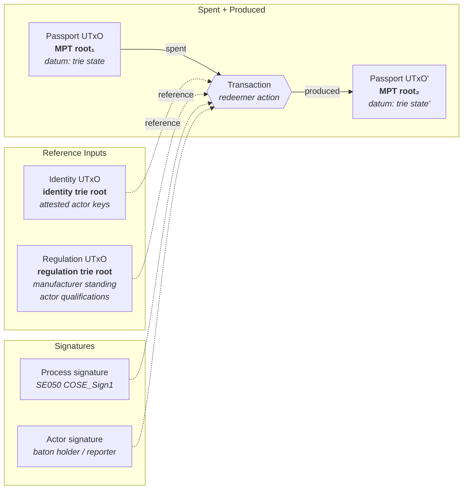
```mermaid
graph LR
    subgraph Reference Inputs
        ID_UTxO["Identity UTxO<br/><b>identity trie root</b><br/><i>attested actor keys</i>"]
        REG_UTxO["Regulation UTxO<br/><b>regulation trie root</b><br/><i>manufacturer standing<br/>actor qualifications</i>"]
    end

    subgraph Spent + Produced
        TRIE_IN["Passport UTxO<br/><b>MPT root₁</b><br/><i>datum: trie state</i>"]
        TX{{"Transaction<br/><i>redeemer action</i>"}}
        TRIE_OUT["Passport UTxO'<br/><b>MPT root₂</b><br/><i>datum: trie state'</i>"]
    end

    TRIE_IN -->|spent| TX
    TX -->|produced| TRIE_OUT
    ID_UTxO -.->|reference| TX
    REG_UTxO -.->|reference| TX

    subgraph Signatures
        SIG_ITEM["Process signature<br/><i>SE050 COSE_Sign1</i>"]
        SIG_ACTOR["Actor signature<br/><i>baton holder / reporter</i>"]
    end

    SIG_ITEM -.-> TX
    SIG_ACTOR -.-> TX
```

The critical difference from the GDPR contract: the process signature comes
from **hardware** — an NXP SE050 secure element inside the battery, signing
via NFC. The chain verifies this signature using Plutus built-in Ed25519 or
secp256k1 verifiers.

## Leaf types in the trie

Two leaf types coexist under the same MPT root, distinguished by key
prefix.

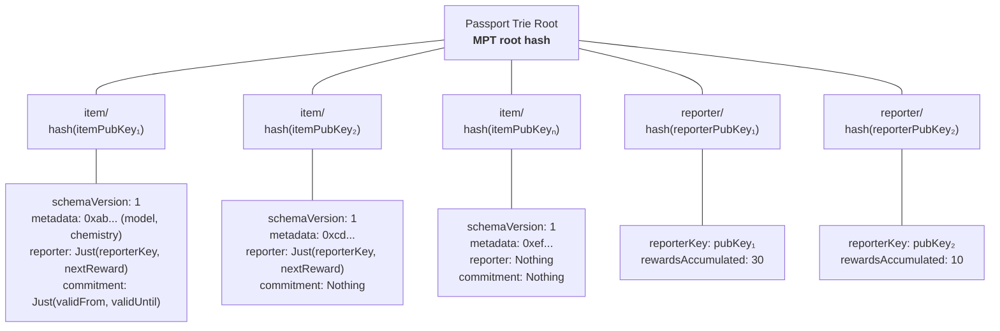
```mermaid
graph TD
    ROOT["Passport Trie Root<br/><b>MPT root hash</b>"]

    ROOT --- ITEM1["item/<br/>hash(itemPubKey₁)"]
    ROOT --- ITEM2["item/<br/>hash(itemPubKey₂)"]
    ROOT --- ITEM3["item/<br/>hash(itemPubKeyₙ)"]
    ROOT --- REP1["reporter/<br/>hash(reporterPubKey₁)"]
    ROOT --- REP2["reporter/<br/>hash(reporterPubKey₂)"]

    ITEM1 --- IL1["schemaVersion: 1<br/>metadata: 0xab... (model, chemistry)<br/>reporter: Just(reporterKey, nextReward)<br/>commitment: Just(validFrom, validUntil)"]
    ITEM2 --- IL2["schemaVersion: 1<br/>metadata: 0xcd...<br/>reporter: Just(reporterKey, nextReward)<br/>commitment: Nothing"]
    ITEM3 --- IL3["schemaVersion: 1<br/>metadata: 0xef...<br/>reporter: Nothing<br/>commitment: Nothing"]

    REP1 --- RL1["reporterKey: pubKey₁<br/>rewardsAccumulated: 30"]
    REP2 --- RL2["reporterKey: pubKey₂<br/>rewardsAccumulated: 10"]
```

### ItemLeaf

| Field | Type | Purpose |
|-------|------|---------|
| `schemaVersion` | Integer | Datum versioning for forward compatibility |
| `metadata` | ByteString | Product-specific: battery model, chemistry, manufacturing date |
| `reporter` | Maybe ReporterAssignment | Who is assigned to report + what reward they get |
| `commitment` | Maybe Commitment | Time window for the next reading (single-use) |

### ReporterAssignment

| Field | Type | Invariant |
|-------|------|-----------|
| `reporterPubKey` | ByteString | Key of the assigned reader (consumer, technician) |
| `nextReward` | Integer | Always > 0 — reward for the next valid reading |

### Commitment

| Field | Type | Purpose |
|-------|------|---------|
| `validFrom` | Integer (slot) | Earliest slot the reading is accepted |
| `validUntil` | Integer (slot) | Latest slot — deadline for the reading |

### ReporterLeaf

| Field | Type | Invariant |
|-------|------|-----------|
| `reporterKey` | ByteString | Reporter's public key |
| `rewardsAccumulated` | Integer | Monotonically increasing — never decreases |

## Redeemer actions

Seven redeemer actions grouped by lifecycle phase.

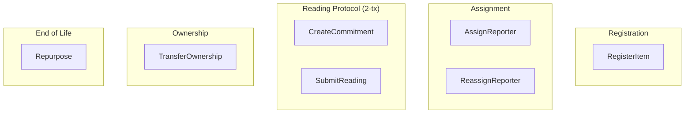
```mermaid
graph TB
    subgraph "Registration"
        R1["RegisterItem"]
    end

    subgraph "Assignment"
        R2["AssignReporter"]
        R3["ReassignReporter"]
    end

    subgraph "Reading Protocol (2-tx)"
        R4["CreateCommitment"]
        R5["SubmitReading"]
    end

    subgraph "Ownership"
        R6["TransferOwnership"]
    end

    subgraph "End of Life"
        R7["Repurpose"]
    end
```

## UTxO state transitions per action

### RegisterItem

Manufacturer creates a new battery passport leaf in the trie. The battery
is virgin — no reporter assigned, no commitment.

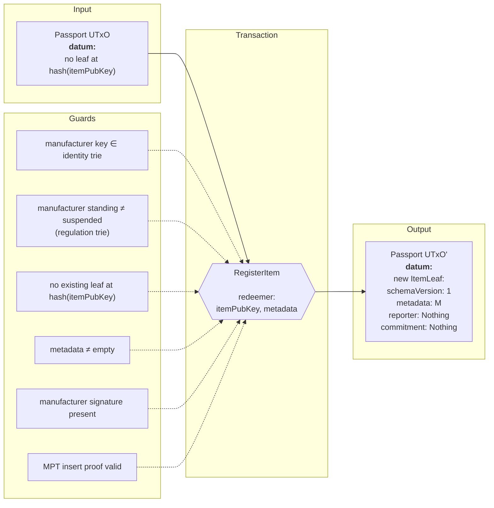
```mermaid
graph LR
    subgraph Input
        IN["Passport UTxO<br/><b>datum:</b><br/>no leaf at hash(itemPubKey)"]
    end

    subgraph Transaction
        TX{{"RegisterItem<br/><br/>redeemer:<br/>itemPubKey, metadata"}}
    end

    subgraph Output
        OUT["Passport UTxO'<br/><b>datum:</b><br/>new ItemLeaf:<br/>  schemaVersion: 1<br/>  metadata: M<br/>  reporter: Nothing<br/>  commitment: Nothing"]
    end

    IN --> TX --> OUT

    subgraph Guards
        G1["manufacturer key ∈ identity trie"]
        G2["manufacturer standing ≠ suspended<br/>(regulation trie)"]
        G3["no existing leaf at hash(itemPubKey)"]
        G4["metadata ≠ empty"]
        G5["manufacturer signature present"]
        G6["MPT insert proof valid"]
    end

    G1 -.-> TX
    G2 -.-> TX
    G3 -.-> TX
    G4 -.-> TX
    G5 -.-> TX
    G6 -.-> TX
```

### AssignReporter

Manufacturer assigns a reporter (consumer, technician) to a battery. This
determines who can trigger readings and earn rewards.

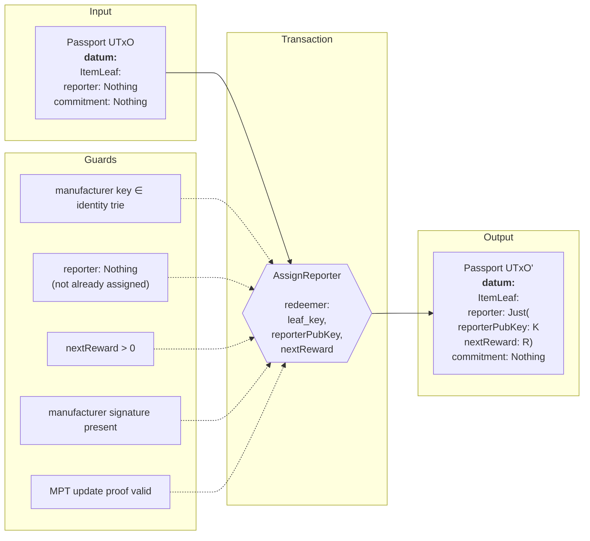
```mermaid
graph LR
    subgraph Input
        IN["Passport UTxO<br/><b>datum:</b><br/>ItemLeaf:<br/>  reporter: Nothing<br/>  commitment: Nothing"]
    end

    subgraph Transaction
        TX{{"AssignReporter<br/><br/>redeemer:<br/>leaf_key,<br/>reporterPubKey,<br/>nextReward"}}
    end

    subgraph Output
        OUT["Passport UTxO'<br/><b>datum:</b><br/>ItemLeaf:<br/>  reporter: Just(<br/>    reporterPubKey: K<br/>    nextReward: R)<br/>  commitment: Nothing"]
    end

    IN --> TX --> OUT

    subgraph Guards
        G1["manufacturer key ∈ identity trie"]
        G2["reporter: Nothing<br/>(not already assigned)"]
        G3["nextReward > 0"]
        G4["manufacturer signature present"]
        G5["MPT update proof valid"]
    end

    G1 -.-> TX
    G2 -.-> TX
    G3 -.-> TX
    G4 -.-> TX
    G5 -.-> TX
```

### ReassignReporter

Replace the current reporter. The old reporter keeps their accumulated
rewards.

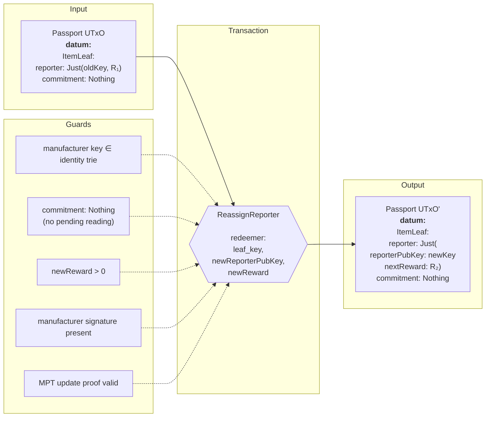
```mermaid
graph LR
    subgraph Input
        IN["Passport UTxO<br/><b>datum:</b><br/>ItemLeaf:<br/>  reporter: Just(oldKey, R₁)<br/>  commitment: Nothing"]
    end

    subgraph Transaction
        TX{{"ReassignReporter<br/><br/>redeemer:<br/>leaf_key,<br/>newReporterPubKey,<br/>newReward"}}
    end

    subgraph Output
        OUT["Passport UTxO'<br/><b>datum:</b><br/>ItemLeaf:<br/>  reporter: Just(<br/>    reporterPubKey: newKey<br/>    nextReward: R₂)<br/>  commitment: Nothing"]
    end

    IN --> TX --> OUT

    subgraph Guards
        G1["manufacturer key ∈ identity trie"]
        G2["commitment: Nothing<br/>(no pending reading)"]
        G3["newReward > 0"]
        G4["manufacturer signature present"]
        G5["MPT update proof valid"]
    end

    G1 -.-> TX
    G2 -.-> TX
    G3 -.-> TX
    G4 -.-> TX
    G5 -.-> TX
```

### CreateCommitment

The manufacturer opens a reading window on a battery. This is Tx 1 of the
two-transaction protocol — the chain's slot becomes the trusted clock.

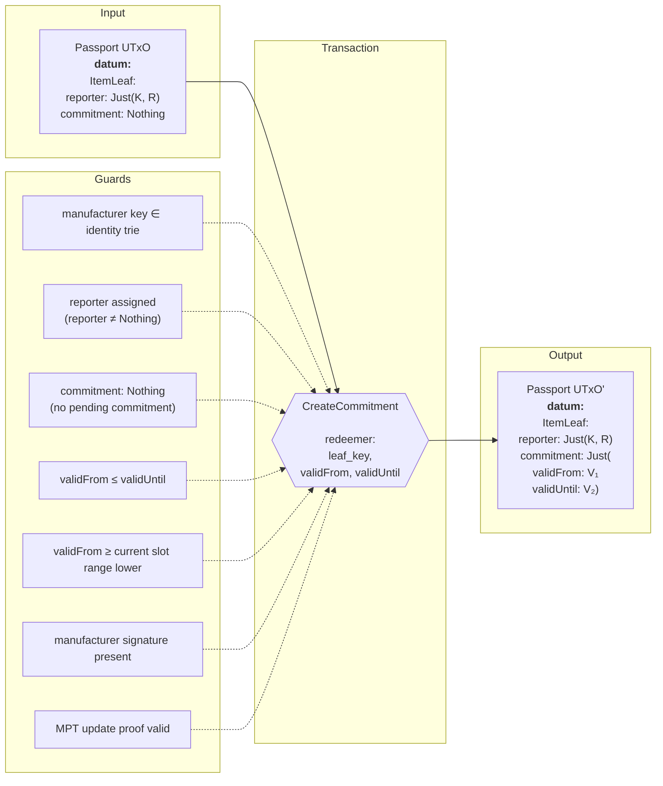
```mermaid
graph LR
    subgraph Input
        IN["Passport UTxO<br/><b>datum:</b><br/>ItemLeaf:<br/>  reporter: Just(K, R)<br/>  commitment: Nothing"]
    end

    subgraph Transaction
        TX{{"CreateCommitment<br/><br/>redeemer:<br/>leaf_key,<br/>validFrom, validUntil"}}
    end

    subgraph Output
        OUT["Passport UTxO'<br/><b>datum:</b><br/>ItemLeaf:<br/>  reporter: Just(K, R)<br/>  commitment: Just(<br/>    validFrom: V₁<br/>    validUntil: V₂)"]
    end

    IN --> TX --> OUT

    subgraph Guards
        G1["manufacturer key ∈ identity trie"]
        G2["reporter assigned<br/>(reporter ≠ Nothing)"]
        G3["commitment: Nothing<br/>(no pending commitment)"]
        G4["validFrom ≤ validUntil"]
        G5["validFrom ≥ current slot range lower"]
        G6["manufacturer signature present"]
        G7["MPT update proof valid"]
    end

    G1 -.-> TX
    G2 -.-> TX
    G3 -.-> TX
    G4 -.-> TX
    G5 -.-> TX
    G6 -.-> TX
    G7 -.-> TX
```

### SubmitReading

The reporter submits a signed BMS reading from the battery's secure
element. Tx 2 of the protocol — clears the commitment and credits the
reward. This is the core transaction of the entire system.

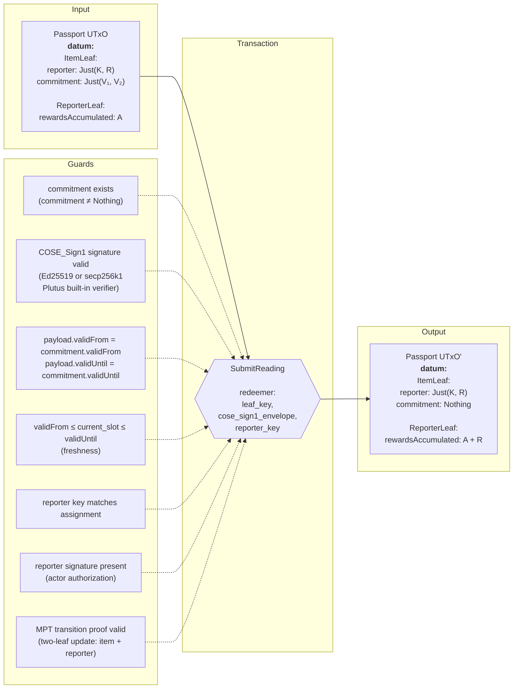
```mermaid
graph LR
    subgraph Input
        IN["Passport UTxO<br/><b>datum:</b><br/>ItemLeaf:<br/>  reporter: Just(K, R)<br/>  commitment: Just(V₁, V₂)<br/><br/>ReporterLeaf:<br/>  rewardsAccumulated: A"]
    end

    subgraph Transaction
        TX{{"SubmitReading<br/><br/>redeemer:<br/>leaf_key,<br/>cose_sign1_envelope,<br/>reporter_key"}}
    end

    subgraph Output
        OUT["Passport UTxO'<br/><b>datum:</b><br/>ItemLeaf:<br/>  reporter: Just(K, R)<br/>  commitment: Nothing<br/><br/>ReporterLeaf:<br/>  rewardsAccumulated: A + R"]
    end

    IN --> TX --> OUT

    subgraph Guards
        G1["commitment exists<br/>(commitment ≠ Nothing)"]
        G2["COSE_Sign1 signature valid<br/>(Ed25519 or secp256k1<br/>Plutus built-in verifier)"]
        G3["payload.validFrom = commitment.validFrom<br/>payload.validUntil = commitment.validUntil"]
        G4["validFrom ≤ current_slot ≤ validUntil<br/>(freshness)"]
        G5["reporter key matches assignment"]
        G6["reporter signature present<br/>(actor authorization)"]
        G7["MPT transition proof valid<br/>(two-leaf update: item + reporter)"]
    end

    G1 -.-> TX
    G2 -.-> TX
    G3 -.-> TX
    G4 -.-> TX
    G5 -.-> TX
    G6 -.-> TX
    G7 -.-> TX
```

!!! note "Two leaves updated atomically"
    SubmitReading is the only action that updates **two** leaves in a single
    transaction: the item leaf (commitment cleared) and the reporter leaf
    (reward credited). The MPT transition proof must cover both updates.

### TransferOwnership

Battery changes hands. Both seller and buyer sign. A fresh BMS reading is
attached as proof of condition at the point of sale.

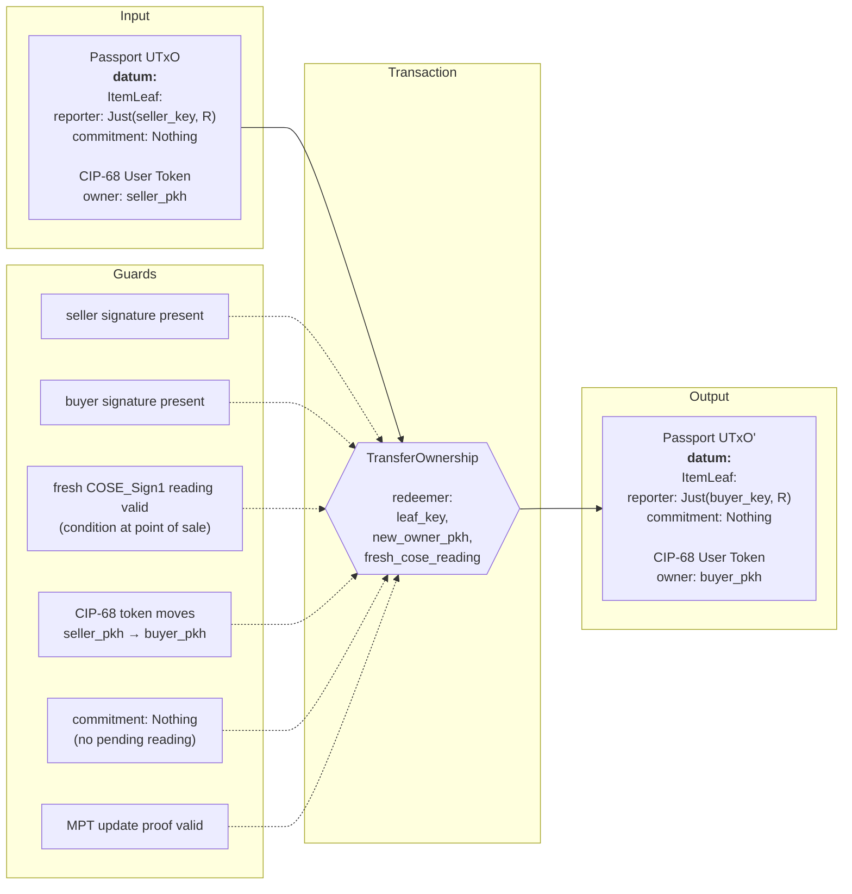
```mermaid
graph LR
    subgraph Input
        IN["Passport UTxO<br/><b>datum:</b><br/>ItemLeaf:<br/>  reporter: Just(seller_key, R)<br/>  commitment: Nothing<br/><br/>CIP-68 User Token<br/>  owner: seller_pkh"]
    end

    subgraph Transaction
        TX{{"TransferOwnership<br/><br/>redeemer:<br/>leaf_key,<br/>new_owner_pkh,<br/>fresh_cose_reading"}}
    end

    subgraph Output
        OUT["Passport UTxO'<br/><b>datum:</b><br/>ItemLeaf:<br/>  reporter: Just(buyer_key, R)<br/>  commitment: Nothing<br/><br/>CIP-68 User Token<br/>  owner: buyer_pkh"]
    end

    IN --> TX --> OUT

    subgraph Guards
        G1["seller signature present"]
        G2["buyer signature present"]
        G3["fresh COSE_Sign1 reading valid<br/>(condition at point of sale)"]
        G4["CIP-68 token moves<br/>seller_pkh → buyer_pkh"]
        G5["commitment: Nothing<br/>(no pending reading)"]
        G6["MPT update proof valid"]
    end

    G1 -.-> TX
    G2 -.-> TX
    G3 -.-> TX
    G4 -.-> TX
    G5 -.-> TX
    G6 -.-> TX
```

### Repurpose

End of first life. The original operator marks the leaf as handed off,
and the new operator (repurposer) creates a new leaf in their own trie
with a back-link.

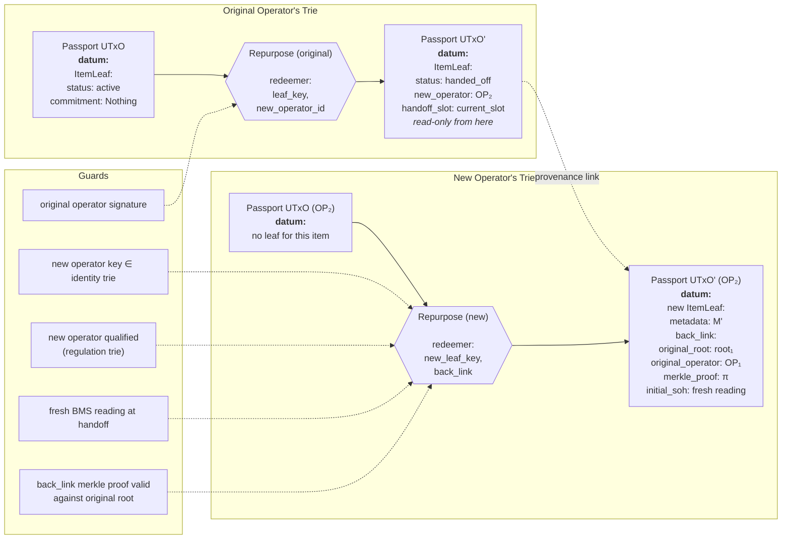
```mermaid
graph LR
    subgraph "Original Operator's Trie"
        IN["Passport UTxO<br/><b>datum:</b><br/>ItemLeaf:<br/>  status: active<br/>  commitment: Nothing"]
        TX1{{"Repurpose (original)<br/><br/>redeemer:<br/>leaf_key,<br/>new_operator_id"}}
        OUT1["Passport UTxO'<br/><b>datum:</b><br/>ItemLeaf:<br/>  status: handed_off<br/>  new_operator: OP₂<br/>  handoff_slot: current_slot<br/>  <i>read-only from here</i>"]
    end

    subgraph "New Operator's Trie"
        IN2["Passport UTxO (OP₂)<br/><b>datum:</b><br/>no leaf for this item"]
        TX2{{"Repurpose (new)<br/><br/>redeemer:<br/>new_leaf_key,<br/>back_link"}}
        OUT2["Passport UTxO' (OP₂)<br/><b>datum:</b><br/>new ItemLeaf:<br/>  metadata: M'<br/>  back_link:<br/>    original_root: root₁<br/>    original_operator: OP₁<br/>    merkle_proof: π<br/>  initial_soh: fresh reading"]
    end

    IN --> TX1 --> OUT1
    IN2 --> TX2 --> OUT2
    OUT1 -.->|provenance link| OUT2

    subgraph Guards
        GR1["original operator signature"]
        GR2["new operator key ∈ identity trie"]
        GR3["new operator qualified<br/>(regulation trie)"]
        GR4["fresh BMS reading at handoff"]
        GR5["back_link merkle proof valid<br/>against original root"]
    end

    GR1 -.-> TX1
    GR2 -.-> TX2
    GR3 -.-> TX2
    GR4 -.-> TX2
    GR5 -.-> TX2
```

!!! note "Two transactions, two operators, two tries"
    Repurposing is a **cross-trie** operation. The original operator marks
    their leaf as read-only. The new operator creates a new leaf in their
    own trie with a back-link (original root hash + Merkle proof). Full
    provenance is verifiable across both tries.

## Validator guard table

| Guard | Register | Assign | Reassign | Commit | Submit | Transfer | Repurpose |
|-------|:---:|:---:|:---:|:---:|:---:|:---:|:---:|
| Manufacturer key ∈ identity trie | **x** | **x** | **x** | **x** | | | **x** |
| Standing ≠ suspended (reg trie) | **x** | | | | | | |
| No existing leaf at key | **x** | | | | | | |
| reporter = Nothing | | **x** | | | | | |
| commitment = Nothing | | | **x** | **x** | | **x** | **x** |
| reporter ≠ Nothing | | | | **x** | **x** | | |
| commitment ≠ Nothing | | | | | **x** | | |
| nextReward > 0 | | **x** | **x** | | | | |
| validFrom ≤ validUntil | | | | **x** | | | |
| COSE_Sign1 valid (hardware sig) | | | | | **x** | **x** | **x** |
| Payload matches commitment | | | | | **x** | | |
| Freshness: slot in [V₁, V₂] | | | | | **x** | | |
| Reporter key matches assignment | | | | | **x** | | |
| Reporter signature (actor auth) | | | | | **x** | | |
| Seller + buyer signatures | | | | | | **x** | |
| CIP-68 token transfer | | | | | | **x** | |
| New operator ∈ identity trie | | | | | | | **x** |
| New operator qualified (reg trie) | | | | | | | **x** |
| Back-link Merkle proof valid | | | | | | | **x** |
| Manufacturer signature | **x** | **x** | **x** | **x** | | | **x** |
| MPT proof valid | **x** | **x** | **x** | **x** | **x** | **x** | **x** |

!!! note "Universal guard"
    MPT proof validity applies to every action — the root hash must be
    correctly recomputed after the leaf update. For SubmitReading, the
    proof covers a two-leaf update (item + reporter).

## Lifecycle state machines

### Item leaf lifecycle

The main state machine — from manufacturing to end of life.

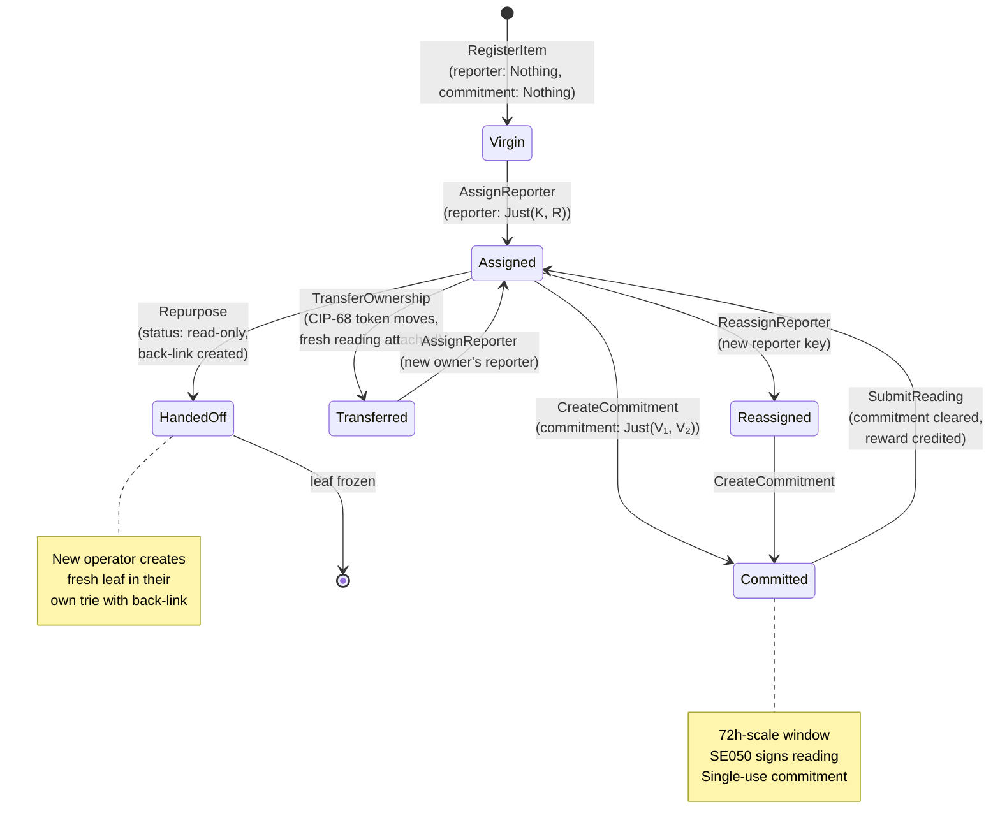
```mermaid
stateDiagram-v2
    [*] --> Virgin: RegisterItem<br/>(reporter: Nothing, commitment: Nothing)

    Virgin --> Assigned: AssignReporter<br/>(reporter: Just(K, R))

    Assigned --> Committed: CreateCommitment<br/>(commitment: Just(V₁, V₂))

    Committed --> Assigned: SubmitReading<br/>(commitment cleared,<br/>reward credited)

    Assigned --> Reassigned: ReassignReporter<br/>(new reporter key)
    Reassigned --> Committed: CreateCommitment

    Assigned --> Transferred: TransferOwnership<br/>(CIP-68 token moves,<br/>fresh reading attached)
    Transferred --> Assigned: AssignReporter<br/>(new owner's reporter)

    Assigned --> HandedOff: Repurpose<br/>(status: read-only,<br/>back-link created)
    HandedOff --> [*]: leaf frozen

    note right of Committed
        72h-scale window
        SE050 signs reading
        Single-use commitment
    end note

    note right of HandedOff
        New operator creates
        fresh leaf in their
        own trie with back-link
    end note
```

### Commitment lifecycle (the 2-tx protocol)

The core protocol — zoomed in on the commitment field.

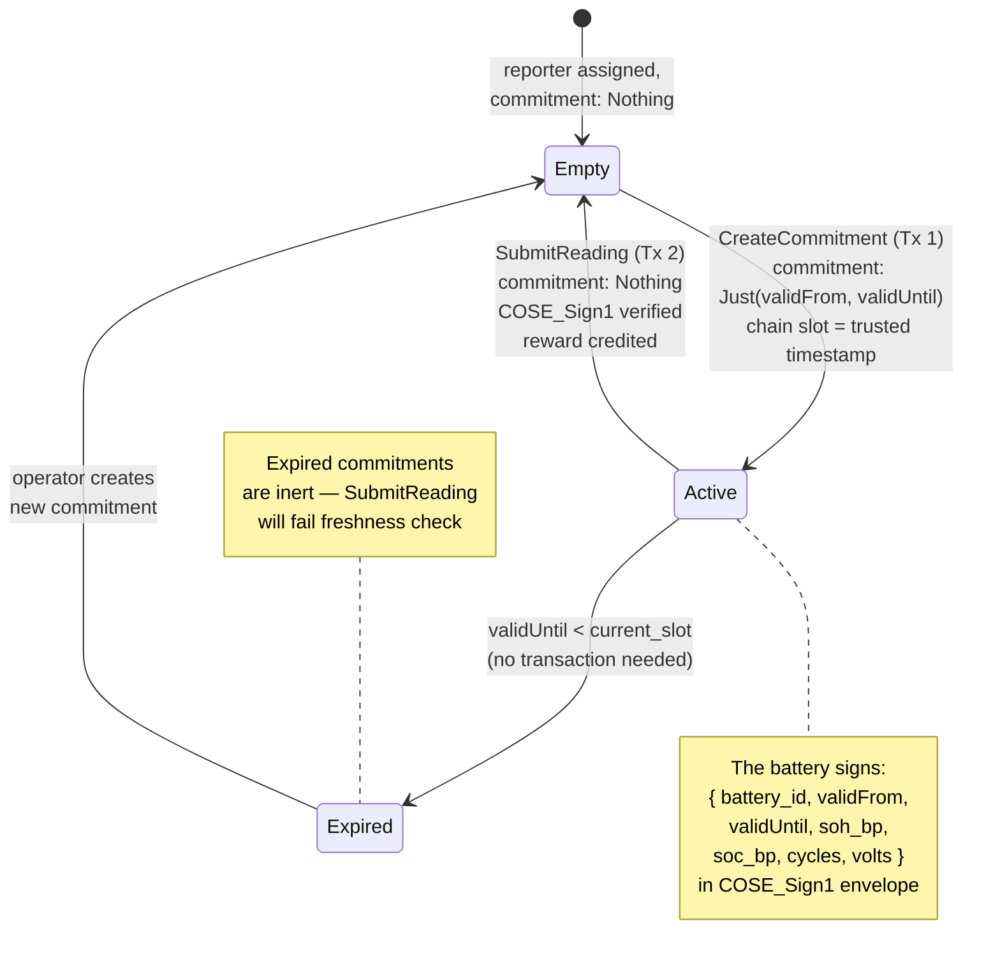
```mermaid
stateDiagram-v2
    [*] --> Empty: reporter assigned,<br/>commitment: Nothing

    Empty --> Active: CreateCommitment (Tx 1)<br/>commitment: Just(validFrom, validUntil)<br/>chain slot = trusted timestamp

    Active --> Empty: SubmitReading (Tx 2)<br/>commitment: Nothing<br/>COSE_Sign1 verified<br/>reward credited

    Active --> Expired: validUntil < current_slot<br/>(no transaction needed)
    Expired --> Empty: operator creates<br/>new commitment

    note right of Active
        The battery signs:
        { battery_id, validFrom,
          validUntil, soh_bp,
          soc_bp, cycles, volts }
        in COSE_Sign1 envelope
    end note

    note left of Expired
        Expired commitments
        are inert — SubmitReading
        will fail freshness check
    end note
```

### Reward accumulation

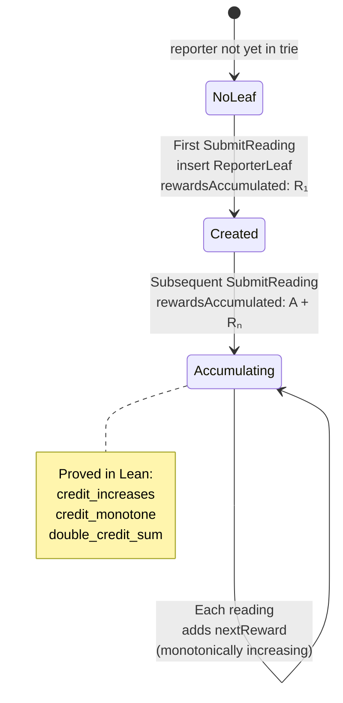
```mermaid
stateDiagram-v2
    [*] --> NoLeaf: reporter not yet in trie

    NoLeaf --> Created: First SubmitReading<br/>insert ReporterLeaf<br/>rewardsAccumulated: R₁

    Created --> Accumulating: Subsequent SubmitReading<br/>rewardsAccumulated: A + Rₙ

    Accumulating --> Accumulating: Each reading<br/>adds nextReward<br/>(monotonically increasing)

    note right of Accumulating
        Proved in Lean:
        credit_increases
        credit_monotone
        double_credit_sum
    end note
```

### Battery lifecycle (regulatory)

The physical lifecycle mapped to on-chain states, per (EU) 2023/1542.

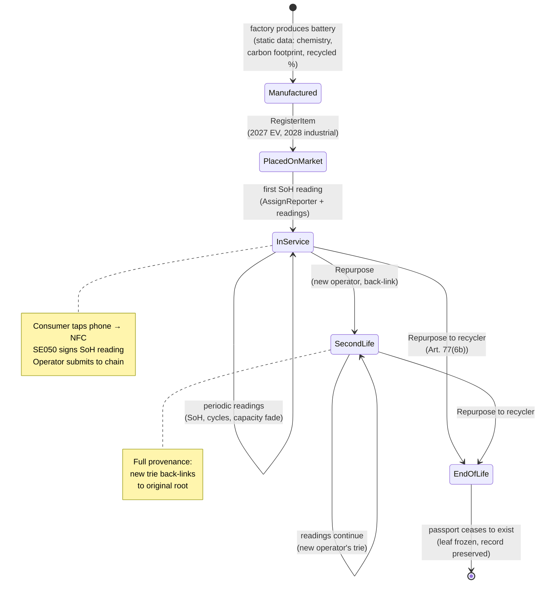
```mermaid
stateDiagram-v2
    [*] --> Manufactured: factory produces battery<br/>(static data: chemistry,<br/>carbon footprint, recycled %)

    Manufactured --> PlacedOnMarket: RegisterItem<br/>(2027 EV, 2028 industrial)

    PlacedOnMarket --> InService: first SoH reading<br/>(AssignReporter + readings)

    InService --> InService: periodic readings<br/>(SoH, cycles, capacity fade)

    InService --> SecondLife: Repurpose<br/>(new operator, back-link)
    SecondLife --> SecondLife: readings continue<br/>(new operator's trie)

    InService --> EndOfLife: Repurpose to recycler<br/>(Art. 77(6b))
    SecondLife --> EndOfLife: Repurpose to recycler

    EndOfLife --> [*]: passport ceases to exist<br/>(leaf frozen, record preserved)

    note right of InService
        Consumer taps phone → NFC
        SE050 signs SoH reading
        Operator submits to chain
    end note

    note right of SecondLife
        Full provenance:
        new trie back-links
        to original root
    end note
```

## The full transaction: SoH reading

End-to-end flow for the two-transaction commitment protocol, showing the
hardware interaction.

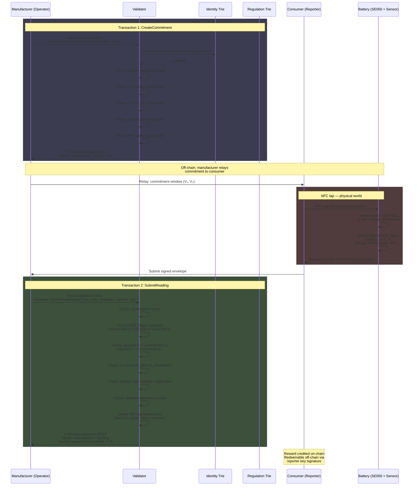
```mermaid
sequenceDiagram
    participant MFR as Manufacturer (Operator)
    participant V as Validator
    participant IT as Identity Trie
    participant RT as Regulation Trie
    participant U as Consumer (Reporter)
    participant BMS as Battery (SE050 + Sensor)

    rect rgb(60, 60, 80)
    Note over MFR,RT: Transaction 1: CreateCommitment

    MFR->>V: Spend passport UTxO<br/>redeemer: CreateCommitment(leaf_key, V₁, V₂)
    V->>IT: Read reference: manufacturer key present?
    IT-->>V: ✓ attested
    V->>V: Check: reporter assigned on leaf
    V->>V: Check: no existing commitment
    V->>V: Check: V₁ ≤ V₂, V₁ ≥ lower slot
    V->>V: Check: manufacturer signature
    V->>V: Check: MPT update proof valid
    V-->>MFR: ✓ Produce passport UTxO'<br/>datum: commitment = Just(V₁, V₂)
    end

    Note over MFR,BMS: Off-chain: manufacturer relays<br/>commitment to consumer

    MFR->>U: Relay: commitment window (V₁, V₂)

    rect rgb(80, 60, 60)
    Note over U,BMS: NFC tap — physical world

    U->>BMS: NFC tap (phone provides power)
    BMS->>BMS: Sensor reads: SoH, SoC,<br/>cycles, voltage, temperature
    BMS->>BMS: SE050 signs COSE_Sign1:<br/>{ battery_id, V₁, V₂,<br/>  soh_bp: 8800, cycles: 342, ... }
    BMS-->>U: Signed envelope (Ed25519 or secp256k1)
    end

    U->>MFR: Submit signed envelope

    rect rgb(60, 80, 60)
    Note over MFR,RT: Transaction 2: SubmitReading

    MFR->>V: Spend passport UTxO'<br/>redeemer: SubmitReading(leaf_key, cose_envelope, reporter_key)
    V->>V: Check: commitment exists
    V->>V: Verify COSE_Sign1 signature<br/>(Plutus built-in: Ed25519 or secp256k1)
    V->>V: Check: payload.V₁ = commitment.V₁<br/>payload.V₂ = commitment.V₂
    V->>V: Check: V₁ ≤ current_slot ≤ V₂ (freshness)
    V->>V: Check: reporter key matches assignment
    V->>V: Check: reporter signature present
    V->>V: Check: MPT transition proof<br/>(two-leaf update: item + reporter)
    V-->>MFR: ✓ Produce passport UTxO''<br/>datum: commitment = Nothing<br/>reporter.rewardsAccumulated += R
    end

    Note over U: Reward credited on-chain<br/>Redeemable off-chain via<br/>reporter key signature
```

## The hardware signing flow

How the physical measurement becomes an on-chain proof. This is the
detail the GDPR contract does not have — the bridge between the physical
world and the chain.

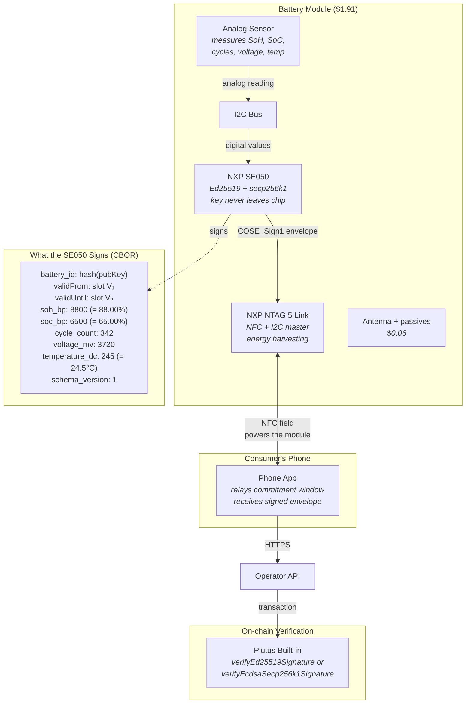
```mermaid
graph TD
    subgraph "Battery Module ($1.91)"
        SENSOR["Analog Sensor<br/><i>measures SoH, SoC,<br/>cycles, voltage, temp</i>"]
        I2C["I2C Bus"]
        SE["NXP SE050<br/><i>Ed25519 + secp256k1<br/>key never leaves chip</i>"]
        NFC["NXP NTAG 5 Link<br/><i>NFC + I2C master<br/>energy harvesting</i>"]
        ANT["Antenna + passives<br/><i>$0.06</i>"]
    end

    subgraph "Consumer's Phone"
        APP["Phone App<br/><i>relays commitment window<br/>receives signed envelope</i>"]
    end

    subgraph "On-chain Verification"
        BUILT_IN["Plutus Built-in<br/><i>verifyEd25519Signature or<br/>verifyEcdsaSecp256k1Signature</i>"]
    end

    SENSOR -->|analog reading| I2C
    I2C -->|digital values| SE
    SE -->|COSE_Sign1 envelope| NFC
    NFC <-->|NFC field<br/>powers the module| APP
    APP -->|HTTPS| OPERATOR["Operator API"]
    OPERATOR -->|transaction| BUILT_IN

    subgraph "What the SE050 Signs (CBOR)"
        PAYLOAD["battery_id: hash(pubKey)<br/>validFrom: slot V₁<br/>validUntil: slot V₂<br/>soh_bp: 8800 (= 88.00%)<br/>soc_bp: 6500 (= 65.00%)<br/>cycle_count: 342<br/>voltage_mv: 3720<br/>temperature_dc: 245 (= 24.5°C)<br/>schema_version: 1"]
    end

    SE -.->|signs| PAYLOAD
```

!!! note "Integer-only encoding"
    All values are integers — no floating point. SoH in basis points
    (8800 = 88.00%), temperature in deci-Celsius (245 = 24.5°C). This
    enables deterministic CBOR encoding without canonicalisation, which is
    critical for signature verification: the byte sequence the SE050
    signed must be exactly reproducible by the Plutus validator.

## Plausibility checks

Beyond cryptographic verification, the validator can enforce physical
plausibility. These are optional guards that catch obvious fraud without
requiring domain expertise.

| Check | Rule | Catches |
|-------|------|---------|
| SoH decreasing | `new_soh_bp ≤ previous_soh_bp` | Manufacturer inflating health |
| Cycles increasing | `new_cycles ≥ previous_cycles` | Resetting cycle counter |
| SoH range | `0 ≤ soh_bp ≤ 10000` | Invalid readings |
| Voltage range | `2500 ≤ voltage_mv ≤ 4500` (Li-ion) | Sensor malfunction |
| Temperature range | `-400 ≤ temp_dc ≤ 800` | Sensor malfunction |

These are **soft guards** — recorded on-chain for auditors rather than
causing transaction rejection. A failing plausibility check flags the
reading but does not prevent it, because the SE050 signature proves the
sensor produced this value. The anomaly is real data, not fraud — the
regulator investigates.

## Comparison with GDPR contract

| Dimension | Battery Contract | GDPR Contract |
|-----------|-----------------|---------------|
| Mode | Physical — hardware signature | Process — server-side signing |
| Process signature source | SE050 secure element (COSE_Sign1) | Authenticated web session |
| Leaf types | ItemLeaf + ReporterLeaf | Consent, breach, rights, Art 30, DPIA, cert |
| Two-leaf atomic update | Yes (item + reporter on SubmitReading) | No (single leaf per action) |
| Reward system | Yes (monotonic accumulator) | No |
| Cross-operator handoff | Repurpose (back-link to original root) | Data portability (Art 20) |
| Plausibility checks | Physics-based (SoH ≤ prev, cycles ≥ prev) | Timeline-based (timeliness flag) |
| Timeliness recording | Freshness check (reject if expired) | Timeliness flag (record, don't reject) |
| CIP-68 token | Yes (ownership transfer) | No |
| Signature curves | Ed25519, secp256k1 (hardware-constrained) | Ed25519 (software, no constraint) |

The battery contract is **strictly more complex** — it has hardware
signatures, two-leaf atomic updates, reward accounting, CIP-68 token
transfer, and cross-operator handoff with Merkle back-links. The GDPR
contract is structurally simpler but covers more redeemer actions because
GDPR has more distinct obligation types.

## Sources

- [EU Battery Regulation (EU) 2023/1542](https://eur-lex.europa.eu/eli/reg/2023/1542/oj) —
  full regulation text
- [Battery Regulation case study](battery-regulation.md) — obligation map,
  constraint check, economics
- [The Extended UTXO Model (IOG)](https://omelkonian.github.io/data/publications/eutxo.pdf) —
  UTxO diagram conventions
- [CIP-31: Reference Inputs](https://cips.cardano.org/cip/CIP-0031) —
  cross-trie verification
- [CIP-68: Datum Metadata Standard](https://cips.cardano.org/cip/CIP-0068) —
  user token pattern for ownership transfer
- [RFC 9052: COSE_Sign1](https://www.rfc-editor.org/rfc/rfc9052) —
  signing envelope format for hardware attestation
- [eu-digital-product-passport](https://github.com/lambdasistemi/eu-digital-product-passport) —
  full implementation with Lean proofs
