# GDPR Smart Contract

Visual specification of the Plutus validator that governs a data controller's
compliance trie. Three complementary diagram types: UTxO state transitions
(what the chain sees), the validator guard table (what the contract checks),
and lifecycle state machines (how compliance records evolve).

## The UTxO landscape

The validator governs one UTxO — the controller's compliance trie root. It
reads two reference inputs: the identity trie (attested actor keys) and the
regulation trie (controller standing, certification body qualifications).

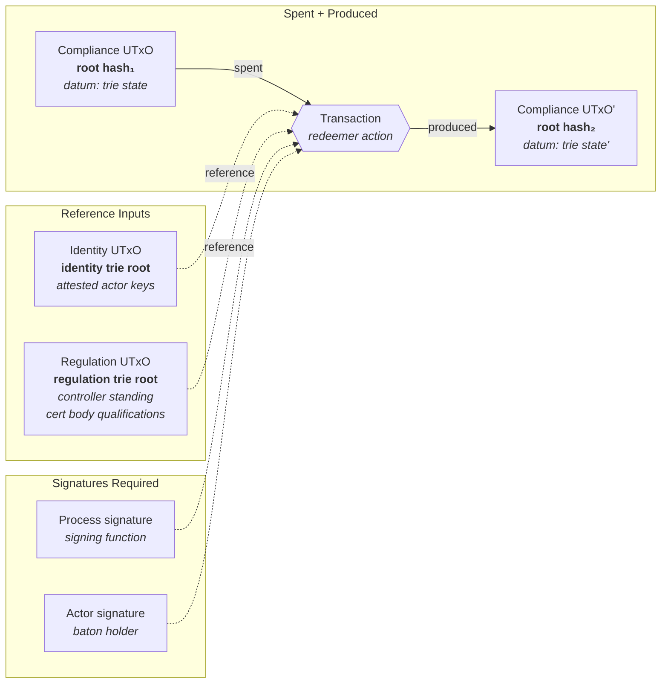
```mermaid
graph LR
    subgraph Reference Inputs
        ID_UTxO["Identity UTxO<br/><b>identity trie root</b><br/><i>attested actor keys</i>"]
        REG_UTxO["Regulation UTxO<br/><b>regulation trie root</b><br/><i>controller standing<br/>cert body qualifications</i>"]
    end

    subgraph Spent + Produced
        TRIE_IN["Compliance UTxO<br/><b>root hash₁</b><br/><i>datum: trie state</i>"]
        TX{{"Transaction<br/><i>redeemer action</i>"}}
        TRIE_OUT["Compliance UTxO'<br/><b>root hash₂</b><br/><i>datum: trie state'</i>"]
    end

    TRIE_IN -->|spent| TX
    TX -->|produced| TRIE_OUT
    ID_UTxO -.->|reference| TX
    REG_UTxO -.->|reference| TX

    subgraph Signatures Required
        SIG_PROC["Process signature<br/><i>signing function</i>"]
        SIG_ACTOR["Actor signature<br/><i>baton holder</i>"]
    end

    SIG_PROC -.-> TX
    SIG_ACTOR -.-> TX
```

Every transaction follows this shape. What changes between redeemer actions
is which guards the validator checks, what the datum transformation must
look like, and which signatures are required.

## Redeemer actions

The contract recognises ten redeemer actions, grouped by GDPR obligation.

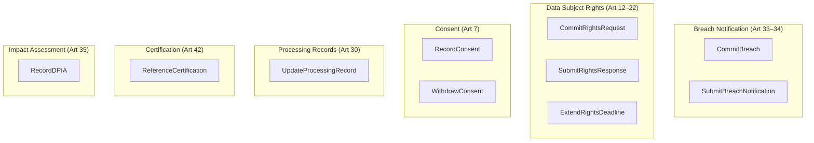
```mermaid
graph TB
    subgraph "Breach Notification (Art 33–34)"
        R1["CommitBreach"]
        R2["SubmitBreachNotification"]
    end

    subgraph "Data Subject Rights (Art 12–22)"
        R3["CommitRightsRequest"]
        R4["SubmitRightsResponse"]
        R5["ExtendRightsDeadline"]
    end

    subgraph "Consent (Art 7)"
        R6["RecordConsent"]
        R7["WithdrawConsent"]
    end

    subgraph "Processing Records (Art 30)"
        R8["UpdateProcessingRecord"]
    end

    subgraph "Certification (Art 42)"
        R9["ReferenceCertification"]
    end

    subgraph "Impact Assessment (Art 35)"
        R10["RecordDPIA"]
    end
```

## UTxO state transitions per action

### CommitBreach

The controller detects a breach and anchors the detection time on-chain.
This is the first half of the 72-hour protocol.

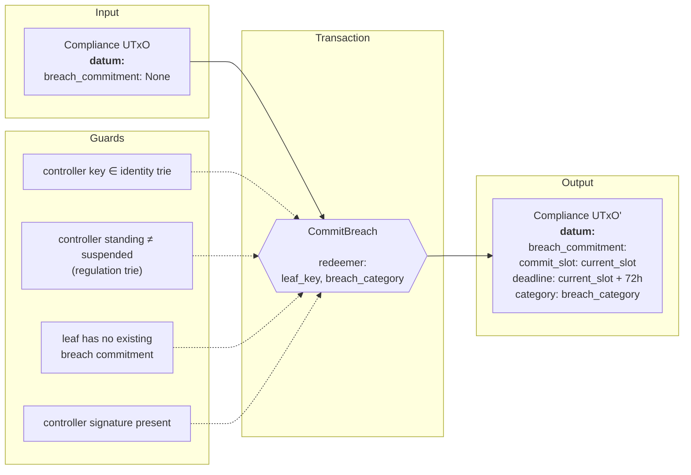
```mermaid
graph LR
    subgraph Input
        IN["Compliance UTxO<br/><b>datum:</b><br/>breach_commitment: None"]
    end

    subgraph Transaction
        TX{{"CommitBreach<br/><br/>redeemer:<br/>leaf_key, breach_category"}}
    end

    subgraph Output
        OUT["Compliance UTxO'<br/><b>datum:</b><br/>breach_commitment:<br/>  commit_slot: current_slot<br/>  deadline: current_slot + 72h<br/>  category: breach_category"]
    end

    IN --> TX --> OUT

    subgraph Guards
        G1["controller key ∈ identity trie"]
        G2["controller standing ≠ suspended<br/>(regulation trie)"]
        G3["leaf has no existing<br/>breach commitment"]
        G4["controller signature present"]
    end

    G1 -.-> TX
    G2 -.-> TX
    G3 -.-> TX
    G4 -.-> TX
```

### SubmitBreachNotification

The controller submits the notification hash, clearing the commitment. The
chain records how many slots elapsed between commitment and submission.

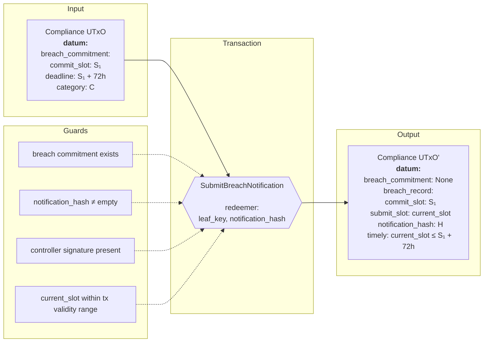
```mermaid
graph LR
    subgraph Input
        IN["Compliance UTxO<br/><b>datum:</b><br/>breach_commitment:<br/>  commit_slot: S₁<br/>  deadline: S₁ + 72h<br/>  category: C"]
    end

    subgraph Transaction
        TX{{"SubmitBreachNotification<br/><br/>redeemer:<br/>leaf_key, notification_hash"}}
    end

    subgraph Output
        OUT["Compliance UTxO'<br/><b>datum:</b><br/>breach_commitment: None<br/>breach_record:<br/>  commit_slot: S₁<br/>  submit_slot: current_slot<br/>  notification_hash: H<br/>  timely: current_slot ≤ S₁ + 72h"]
    end

    IN --> TX --> OUT

    subgraph Guards
        G1["breach commitment exists"]
        G2["notification_hash ≠ empty"]
        G3["controller signature present"]
        G4["current_slot within tx validity range"]
    end

    G1 -.-> TX
    G2 -.-> TX
    G3 -.-> TX
    G4 -.-> TX
```

!!! note "Timeliness is recorded, not enforced"
    The validator does **not** reject late notifications. It records
    `timely: false` when `current_slot > deadline`. The SA reads this
    flag — late submission is evidence for enforcement proceedings, not a
    transaction failure. A controller must be able to submit late rather
    than not submit at all.

### CommitRightsRequest

A data subject submits a rights request. The controller anchors the
receipt time.

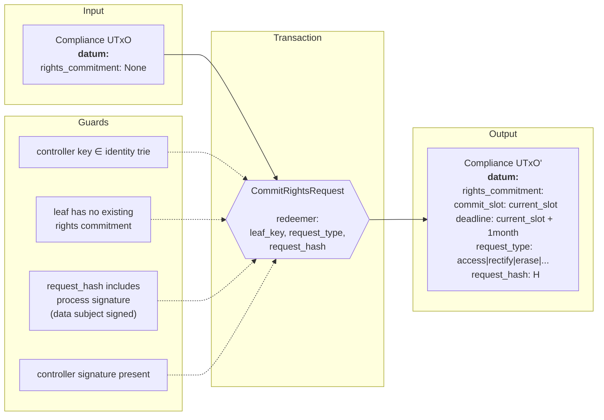
```mermaid
graph LR
    subgraph Input
        IN["Compliance UTxO<br/><b>datum:</b><br/>rights_commitment: None"]
    end

    subgraph Transaction
        TX{{"CommitRightsRequest<br/><br/>redeemer:<br/>leaf_key, request_type,<br/>request_hash"}}
    end

    subgraph Output
        OUT["Compliance UTxO'<br/><b>datum:</b><br/>rights_commitment:<br/>  commit_slot: current_slot<br/>  deadline: current_slot + 1month<br/>  request_type: access|rectify|erase|...<br/>  request_hash: H"]
    end

    IN --> TX --> OUT

    subgraph Guards
        G1["controller key ∈ identity trie"]
        G2["leaf has no existing<br/>rights commitment"]
        G3["request_hash includes<br/>process signature<br/>(data subject signed)"]
        G4["controller signature present"]
    end

    G1 -.-> TX
    G2 -.-> TX
    G3 -.-> TX
    G4 -.-> TX
```

### SubmitRightsResponse

The controller responds within the deadline window.

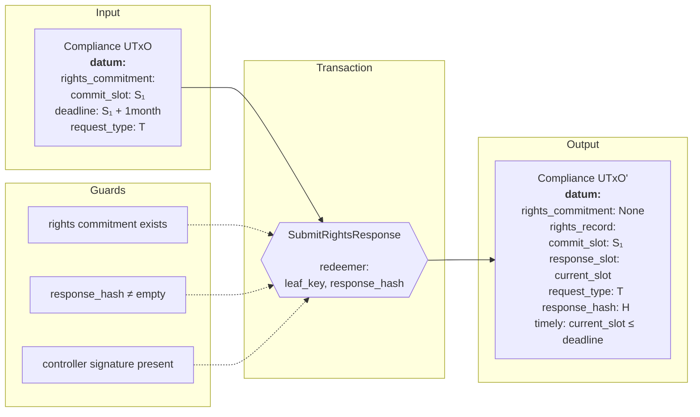
```mermaid
graph LR
    subgraph Input
        IN["Compliance UTxO<br/><b>datum:</b><br/>rights_commitment:<br/>  commit_slot: S₁<br/>  deadline: S₁ + 1month<br/>  request_type: T"]
    end

    subgraph Transaction
        TX{{"SubmitRightsResponse<br/><br/>redeemer:<br/>leaf_key, response_hash"}}
    end

    subgraph Output
        OUT["Compliance UTxO'<br/><b>datum:</b><br/>rights_commitment: None<br/>rights_record:<br/>  commit_slot: S₁<br/>  response_slot: current_slot<br/>  request_type: T<br/>  response_hash: H<br/>  timely: current_slot ≤ deadline"]
    end

    IN --> TX --> OUT

    subgraph Guards
        G1["rights commitment exists"]
        G2["response_hash ≠ empty"]
        G3["controller signature present"]
    end

    G1 -.-> TX
    G2 -.-> TX
    G3 -.-> TX
```

### ExtendRightsDeadline

For complex requests, Art 12(3) allows extension to 3 months. The
controller must notify the subject within the first month.

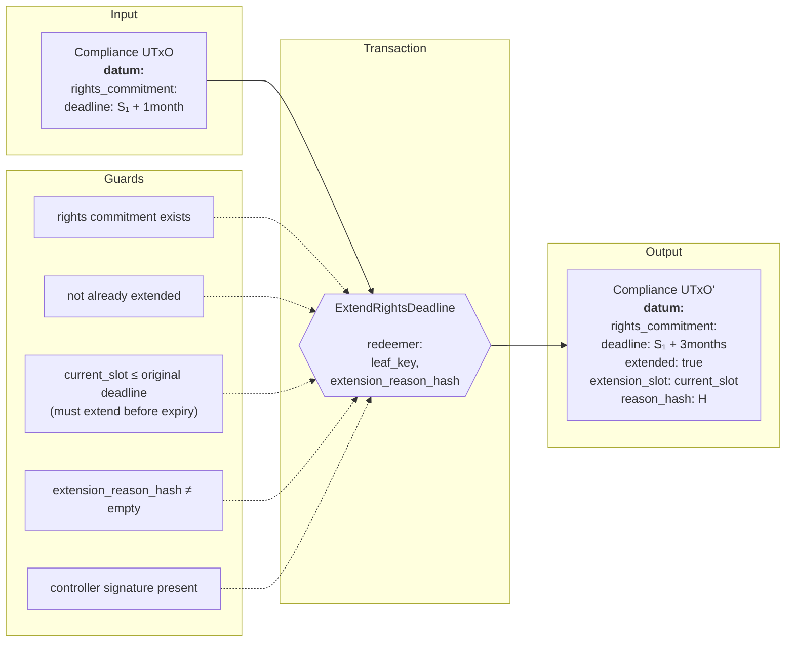
```mermaid
graph LR
    subgraph Input
        IN["Compliance UTxO<br/><b>datum:</b><br/>rights_commitment:<br/>  deadline: S₁ + 1month"]
    end

    subgraph Transaction
        TX{{"ExtendRightsDeadline<br/><br/>redeemer:<br/>leaf_key,<br/>extension_reason_hash"}}
    end

    subgraph Output
        OUT["Compliance UTxO'<br/><b>datum:</b><br/>rights_commitment:<br/>  deadline: S₁ + 3months<br/>  extended: true<br/>  extension_slot: current_slot<br/>  reason_hash: H"]
    end

    IN --> TX --> OUT

    subgraph Guards
        G1["rights commitment exists"]
        G2["not already extended"]
        G3["current_slot ≤ original deadline<br/>(must extend before expiry)"]
        G4["extension_reason_hash ≠ empty"]
        G5["controller signature present"]
    end

    G1 -.-> TX
    G2 -.-> TX
    G3 -.-> TX
    G4 -.-> TX
    G5 -.-> TX
```

### RecordConsent

Consent given for a specific processing purpose.

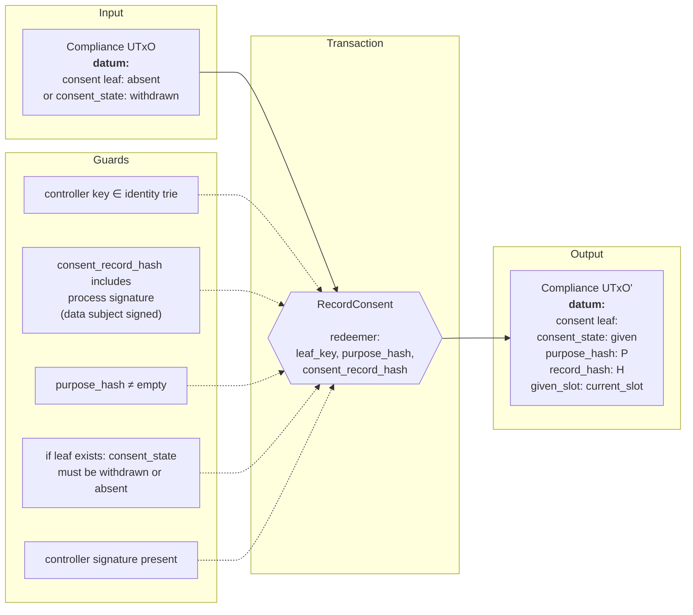
```mermaid
graph LR
    subgraph Input
        IN["Compliance UTxO<br/><b>datum:</b><br/>consent leaf: absent<br/>or consent_state: withdrawn"]
    end

    subgraph Transaction
        TX{{"RecordConsent<br/><br/>redeemer:<br/>leaf_key, purpose_hash,<br/>consent_record_hash"}}
    end

    subgraph Output
        OUT["Compliance UTxO'<br/><b>datum:</b><br/>consent leaf:<br/>  consent_state: given<br/>  purpose_hash: P<br/>  record_hash: H<br/>  given_slot: current_slot"]
    end

    IN --> TX --> OUT

    subgraph Guards
        G1["controller key ∈ identity trie"]
        G2["consent_record_hash includes<br/>process signature<br/>(data subject signed)"]
        G3["purpose_hash ≠ empty"]
        G4["if leaf exists: consent_state<br/>must be withdrawn or absent"]
        G5["controller signature present"]
    end

    G1 -.-> TX
    G2 -.-> TX
    G3 -.-> TX
    G4 -.-> TX
    G5 -.-> TX
```

### WithdrawConsent

Consent withdrawn. Must be as easy as giving it (Art 7(3)).

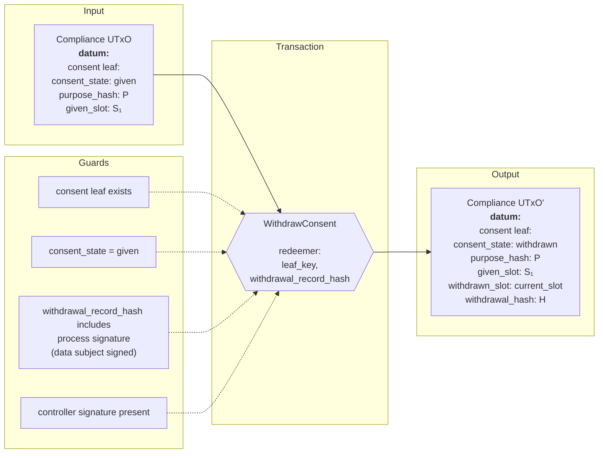
```mermaid
graph LR
    subgraph Input
        IN["Compliance UTxO<br/><b>datum:</b><br/>consent leaf:<br/>  consent_state: given<br/>  purpose_hash: P<br/>  given_slot: S₁"]
    end

    subgraph Transaction
        TX{{"WithdrawConsent<br/><br/>redeemer:<br/>leaf_key,<br/>withdrawal_record_hash"}}
    end

    subgraph Output
        OUT["Compliance UTxO'<br/><b>datum:</b><br/>consent leaf:<br/>  consent_state: withdrawn<br/>  purpose_hash: P<br/>  given_slot: S₁<br/>  withdrawn_slot: current_slot<br/>  withdrawal_hash: H"]
    end

    IN --> TX --> OUT

    subgraph Guards
        G1["consent leaf exists"]
        G2["consent_state = given"]
        G3["withdrawal_record_hash includes<br/>process signature<br/>(data subject signed)"]
        G4["controller signature present"]
    end

    G1 -.-> TX
    G2 -.-> TX
    G3 -.-> TX
    G4 -.-> TX
```

### UpdateProcessingRecord

Art 30 processing activity records — purposes, categories, recipients,
transfers, retention periods.

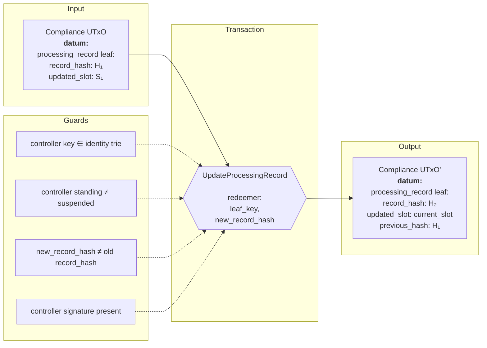
```mermaid
graph LR
    subgraph Input
        IN["Compliance UTxO<br/><b>datum:</b><br/>processing_record leaf:<br/>  record_hash: H₁<br/>  updated_slot: S₁"]
    end

    subgraph Transaction
        TX{{"UpdateProcessingRecord<br/><br/>redeemer:<br/>leaf_key,<br/>new_record_hash"}}
    end

    subgraph Output
        OUT["Compliance UTxO'<br/><b>datum:</b><br/>processing_record leaf:<br/>  record_hash: H₂<br/>  updated_slot: current_slot<br/>  previous_hash: H₁"]
    end

    IN --> TX --> OUT

    subgraph Guards
        G1["controller key ∈ identity trie"]
        G2["controller standing ≠ suspended"]
        G3["new_record_hash ≠ old record_hash"]
        G4["controller signature present"]
    end

    G1 -.-> TX
    G2 -.-> TX
    G3 -.-> TX
    G4 -.-> TX
```

### ReferenceCertification

Controller references a valid Art 42 certification token.

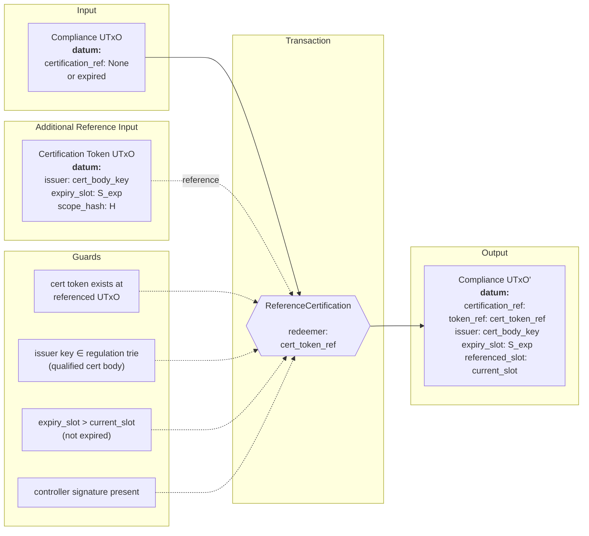
```mermaid
graph LR
    subgraph Input
        IN["Compliance UTxO<br/><b>datum:</b><br/>certification_ref: None<br/>or expired"]
    end

    subgraph Transaction
        TX{{"ReferenceCertification<br/><br/>redeemer:<br/>cert_token_ref"}}
    end

    subgraph "Additional Reference Input"
        CERT["Certification Token UTxO<br/><b>datum:</b><br/>  issuer: cert_body_key<br/>  expiry_slot: S_exp<br/>  scope_hash: H"]
    end

    subgraph Output
        OUT["Compliance UTxO'<br/><b>datum:</b><br/>certification_ref:<br/>  token_ref: cert_token_ref<br/>  issuer: cert_body_key<br/>  expiry_slot: S_exp<br/>  referenced_slot: current_slot"]
    end

    IN --> TX --> OUT
    CERT -.->|reference| TX

    subgraph Guards
        G1["cert token exists at<br/>referenced UTxO"]
        G2["issuer key ∈ regulation trie<br/>(qualified cert body)"]
        G3["expiry_slot > current_slot<br/>(not expired)"]
        G4["controller signature present"]
    end

    G1 -.-> TX
    G2 -.-> TX
    G3 -.-> TX
    G4 -.-> TX
```

### RecordDPIA

DPIA attestation anchored with timestamp.

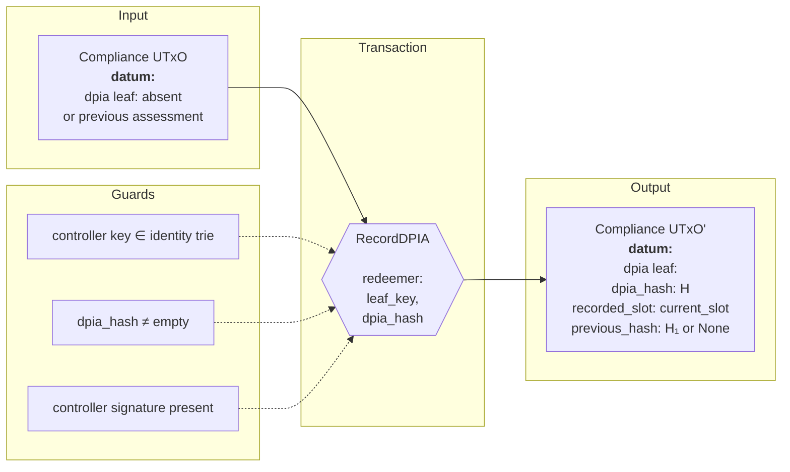
```mermaid
graph LR
    subgraph Input
        IN["Compliance UTxO<br/><b>datum:</b><br/>dpia leaf: absent<br/>or previous assessment"]
    end

    subgraph Transaction
        TX{{"RecordDPIA<br/><br/>redeemer:<br/>leaf_key,<br/>dpia_hash"}}
    end

    subgraph Output
        OUT["Compliance UTxO'<br/><b>datum:</b><br/>dpia leaf:<br/>  dpia_hash: H<br/>  recorded_slot: current_slot<br/>  previous_hash: H₁ or None"]
    end

    IN --> TX --> OUT

    subgraph Guards
        G1["controller key ∈ identity trie"]
        G2["dpia_hash ≠ empty"]
        G3["controller signature present"]
    end

    G1 -.-> TX
    G2 -.-> TX
    G3 -.-> TX
```

## Validator guard table

All guards across all redeemer actions in a single matrix. This is the
complete specification of what the validator checks.

| Guard | CommitBreach | SubmitBreach | CommitRights | SubmitRights | ExtendRights | RecordConsent | WithdrawConsent | UpdateRecord | RefCert | RecordDPIA |
|-------|:---:|:---:|:---:|:---:|:---:|:---:|:---:|:---:|:---:|:---:|
| Controller key ∈ identity trie | **x** | | **x** | | | **x** | | **x** | | **x** |
| Controller standing ≠ suspended | **x** | | | | | | | **x** | | |
| No existing commitment on leaf | **x** | | **x** | | | | | | | |
| Commitment exists on leaf | | **x** | | **x** | **x** | | | | | |
| Hash ≠ empty | | **x** | | **x** | **x** | **x** | | **x** | | **x** |
| Process sig (data subject signed) | | | **x** | | | **x** | **x** | | | |
| Controller signature | **x** | **x** | **x** | **x** | **x** | **x** | **x** | **x** | **x** | **x** |
| Consent state = given | | | | | | | **x** | | | |
| Consent state ≠ given (or absent) | | | | | | **x** | | | | |
| Not already extended | | | | | **x** | | | | | |
| Current slot ≤ original deadline | | | | | **x** | | | | | |
| Cert token exists + not expired | | | | | | | | | **x** | |
| Cert issuer ∈ regulation trie | | | | | | | | | **x** | |
| Root hash consistent (MPT) | **x** | **x** | **x** | **x** | **x** | **x** | **x** | **x** | **x** | **x** |

!!! note "Universal guards"
    Two guards apply to **every** action: controller signature and MPT root
    hash consistency. The controller must sign every transaction (they are
    the operator). The MPT root hash must be recomputed correctly after the
    leaf update (structural integrity of the trie).

## Lifecycle state machines

### Breach notification lifecycle

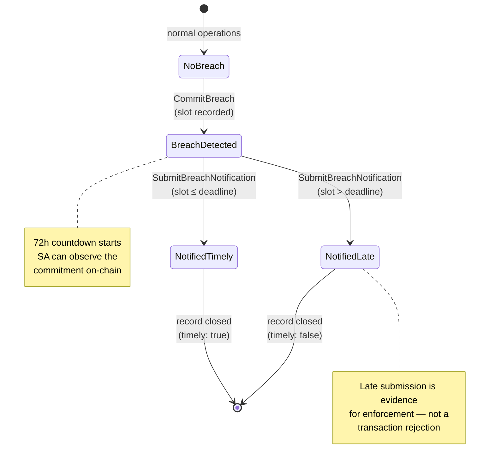
```mermaid
stateDiagram-v2
    [*] --> NoBreach: normal operations

    NoBreach --> BreachDetected: CommitBreach<br/>(slot recorded)

    BreachDetected --> NotifiedTimely: SubmitBreachNotification<br/>(slot ≤ deadline)
    BreachDetected --> NotifiedLate: SubmitBreachNotification<br/>(slot > deadline)

    NotifiedTimely --> [*]: record closed<br/>(timely: true)
    NotifiedLate --> [*]: record closed<br/>(timely: false)

    note right of BreachDetected
        72h countdown starts
        SA can observe the
        commitment on-chain
    end note

    note right of NotifiedLate
        Late submission is evidence
        for enforcement — not a
        transaction rejection
    end note
```

### Rights request lifecycle

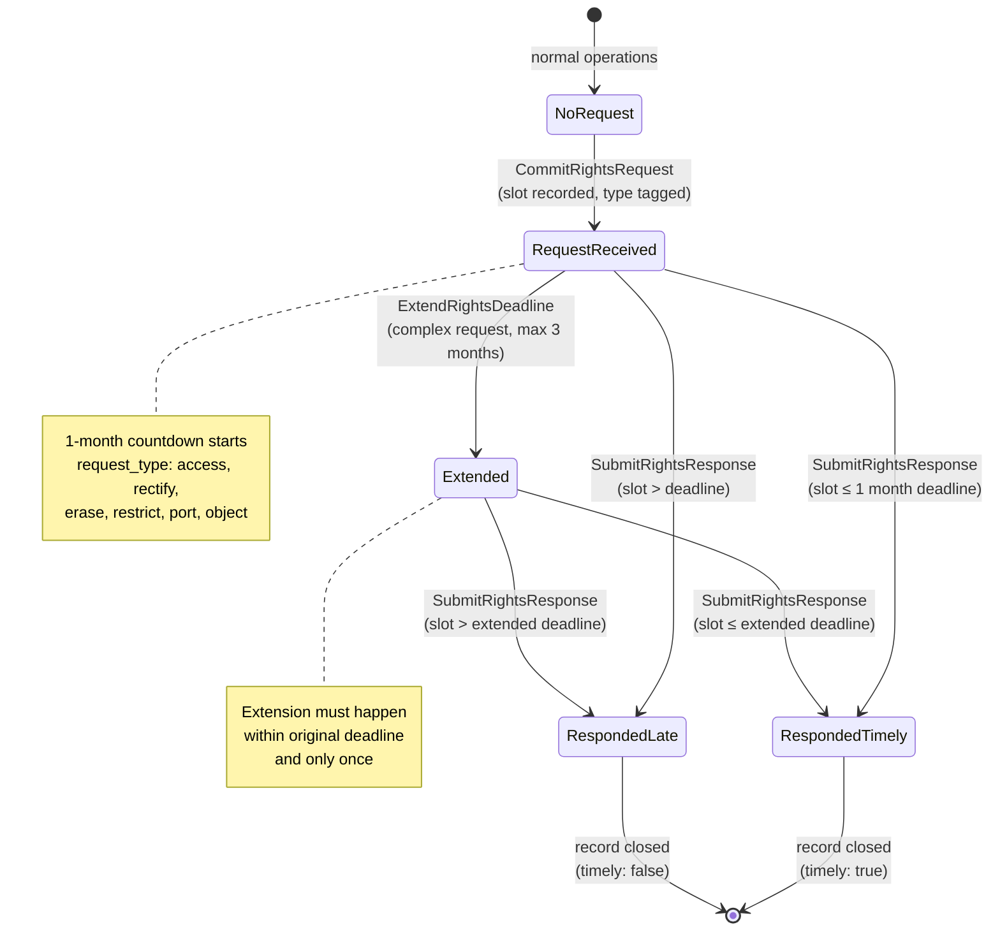
```mermaid
stateDiagram-v2
    [*] --> NoRequest: normal operations

    NoRequest --> RequestReceived: CommitRightsRequest<br/>(slot recorded, type tagged)

    RequestReceived --> Extended: ExtendRightsDeadline<br/>(complex request, max 3 months)
    RequestReceived --> RespondedTimely: SubmitRightsResponse<br/>(slot ≤ 1 month deadline)
    RequestReceived --> RespondedLate: SubmitRightsResponse<br/>(slot > deadline)

    Extended --> RespondedTimely: SubmitRightsResponse<br/>(slot ≤ extended deadline)
    Extended --> RespondedLate: SubmitRightsResponse<br/>(slot > extended deadline)

    RespondedTimely --> [*]: record closed<br/>(timely: true)
    RespondedLate --> [*]: record closed<br/>(timely: false)

    note right of RequestReceived
        1-month countdown starts
        request_type: access, rectify,
        erase, restrict, port, object
    end note

    note right of Extended
        Extension must happen
        within original deadline
        and only once
    end note
```

### Consent lifecycle

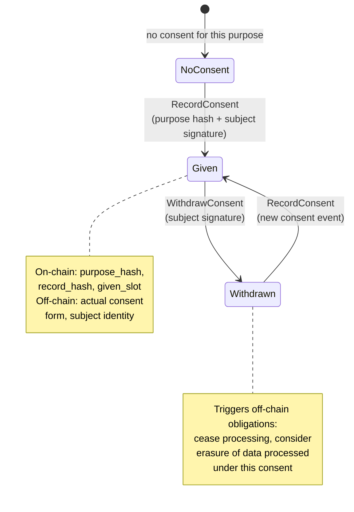
```mermaid
stateDiagram-v2
    [*] --> NoConsent: no consent for this purpose

    NoConsent --> Given: RecordConsent<br/>(purpose hash + subject signature)
    Given --> Withdrawn: WithdrawConsent<br/>(subject signature)
    Withdrawn --> Given: RecordConsent<br/>(new consent event)

    note right of Given
        On-chain: purpose_hash,
        record_hash, given_slot
        Off-chain: actual consent
        form, subject identity
    end note

    note right of Withdrawn
        Triggers off-chain obligations:
        cease processing, consider
        erasure of data processed
        under this consent
    end note
```

### Certification lifecycle

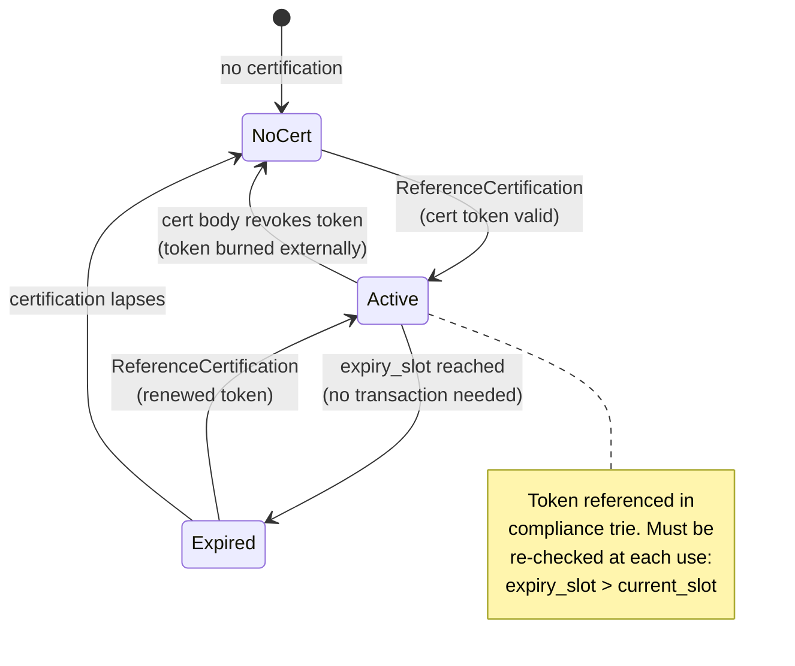
```mermaid
stateDiagram-v2
    [*] --> NoCert: no certification

    NoCert --> Active: ReferenceCertification<br/>(cert token valid)
    Active --> Expired: expiry_slot reached<br/>(no transaction needed)
    Active --> NoCert: cert body revokes token<br/>(token burned externally)
    Expired --> Active: ReferenceCertification<br/>(renewed token)
    Expired --> NoCert: certification lapses

    note right of Active
        Token referenced in
        compliance trie. Must be
        re-checked at each use:
        expiry_slot > current_slot
    end note
```

### Processing record lifecycle

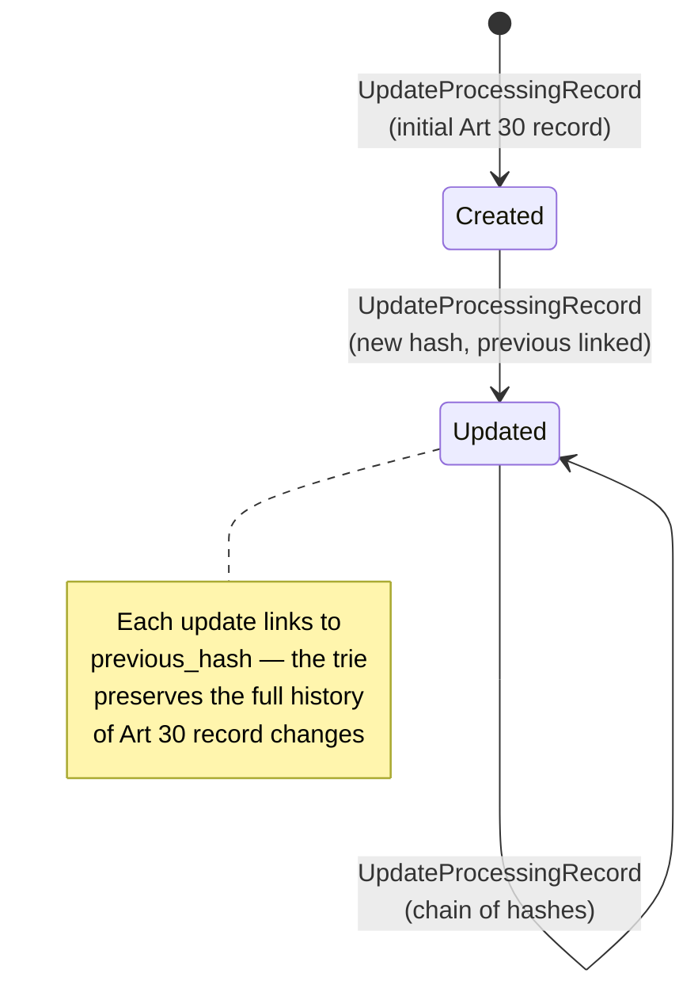
```mermaid
stateDiagram-v2
    [*] --> Created: UpdateProcessingRecord<br/>(initial Art 30 record)

    Created --> Updated: UpdateProcessingRecord<br/>(new hash, previous linked)
    Updated --> Updated: UpdateProcessingRecord<br/>(chain of hashes)

    note right of Updated
        Each update links to
        previous_hash — the trie
        preserves the full history
        of Art 30 record changes
    end note
```

## Composite view: a controller's compliance trie

The trie is a Merkle Patricia Trie where each leaf is a compliance record.
Different leaf types coexist under the same root.

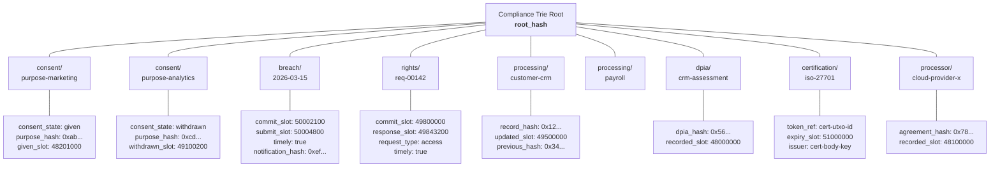
```mermaid
graph TD
    ROOT["Compliance Trie Root<br/><b>root_hash</b>"]

    ROOT --- CONSENT["consent/<br/>purpose-marketing"]
    ROOT --- CONSENT2["consent/<br/>purpose-analytics"]
    ROOT --- BREACH["breach/<br/>2026-03-15"]
    ROOT --- RIGHTS["rights/<br/>req-00142"]
    ROOT --- ART30["processing/<br/>customer-crm"]
    ROOT --- ART30B["processing/<br/>payroll"]
    ROOT --- DPIA["dpia/<br/>crm-assessment"]
    ROOT --- CERT["certification/<br/>iso-27701"]
    ROOT --- PROC["processor/<br/>cloud-provider-x"]

    CONSENT --- CL1["consent_state: given<br/>purpose_hash: 0xab...<br/>given_slot: 48201000"]
    CONSENT2 --- CL2["consent_state: withdrawn<br/>purpose_hash: 0xcd...<br/>withdrawn_slot: 49100200"]
    BREACH --- BL["commit_slot: 50002100<br/>submit_slot: 50004800<br/>timely: true<br/>notification_hash: 0xef..."]
    RIGHTS --- RL["commit_slot: 49800000<br/>response_slot: 49843200<br/>request_type: access<br/>timely: true"]
    ART30 --- AL["record_hash: 0x12...<br/>updated_slot: 49500000<br/>previous_hash: 0x34..."]
    DPIA --- DL["dpia_hash: 0x56...<br/>recorded_slot: 48000000"]
    CERT --- CTL["token_ref: cert-utxo-id<br/>expiry_slot: 51000000<br/>issuer: cert-body-key"]
    PROC --- PL["agreement_hash: 0x78...<br/>recorded_slot: 48100000"]
```

The key path structure (`consent/`, `breach/`, `rights/`, `processing/`,
`dpia/`, `certification/`, `processor/`) is a convention — the validator
identifies leaf type by the redeemer action, not by the key path. The
path exists for off-chain tooling and auditor readability.

## The full transaction: breach notification example

End-to-end UTxO flow for the flagship 72-hour protocol, showing both
transactions.

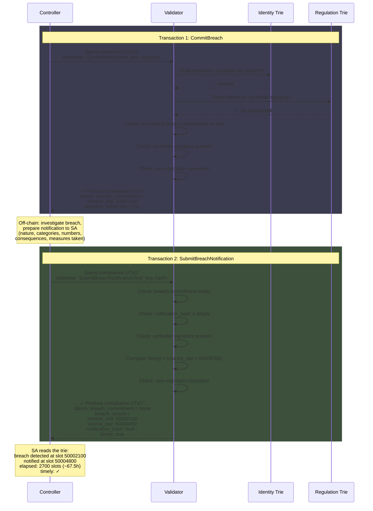
```mermaid
sequenceDiagram
    participant C as Controller
    participant V as Validator
    participant IT as Identity Trie
    participant RT as Regulation Trie

    rect rgb(60, 60, 80)
    Note over C,RT: Transaction 1: CommitBreach

    C->>V: Spend compliance UTxO<br/>redeemer: CommitBreach(leaf_key, category)
    V->>IT: Read reference: controller key present?
    IT-->>V: ✓ attested
    V->>RT: Read reference: controller standing?
    RT-->>V: ✓ not suspended
    V->>V: Check: no existing breach commitment on leaf
    V->>V: Check: controller signature present
    V->>V: Check: new root hash consistent
    V-->>C: ✓ Produce compliance UTxO'<br/>datum: breach_commitment =<br/>  commit_slot: 50002100<br/>  deadline: 50005700 (72h)
    end

    Note over C: Off-chain: investigate breach,<br/>prepare notification to SA<br/>(nature, categories, numbers,<br/>consequences, measures taken)

    rect rgb(60, 80, 60)
    Note over C,RT: Transaction 2: SubmitBreachNotification

    C->>V: Spend compliance UTxO'<br/>redeemer: SubmitBreachNotification(leaf_key, hash)
    V->>V: Check: breach commitment exists
    V->>V: Check: notification_hash ≠ empty
    V->>V: Check: controller signature present
    V->>V: Compute: timely = (current_slot ≤ 50005700)
    V->>V: Check: new root hash consistent
    V-->>C: ✓ Produce compliance UTxO''<br/>datum: breach_commitment = None<br/>  breach_record =<br/>    commit_slot: 50002100<br/>    submit_slot: 50004800<br/>    notification_hash: 0xef...<br/>    timely: true
    end

    Note over C: SA reads the trie:<br/>breach detected at slot 50002100<br/>notified at slot 50004800<br/>elapsed: 2700 slots (~67.5h)<br/>timely: ✓
```

## Sources

The validator design follows patterns established in the framework:

- [The Regulator Schema](../framework/schema.md) — four-party architecture,
  reference inputs, double signature, commitment protocol
- [Architecture Patterns](../framework/patterns.md) — commitment-then-submit,
  lifecycle state machine, MPT-per-operator
- [GDPR case study](gdpr.md) — obligation map, data classification, protocol
  patterns, trust model
- [The Five Constraints](../framework/constraints.md) — why the design
  choices are the way they are

For GDPR article references, see the [GDPR case study sources](gdpr.md#sources).

For eUTxO diagram conventions, see:

- [The Extended UTXO Model (IOG)](https://omelkonian.github.io/data/publications/eutxo.pdf) —
  the foundational paper establishing UTxO transaction diagram notation
- [CIP-31: Reference Inputs](https://cips.cardano.org/cip/CIP-0031) —
  the Cardano feature enabling cross-trie verification without spending
