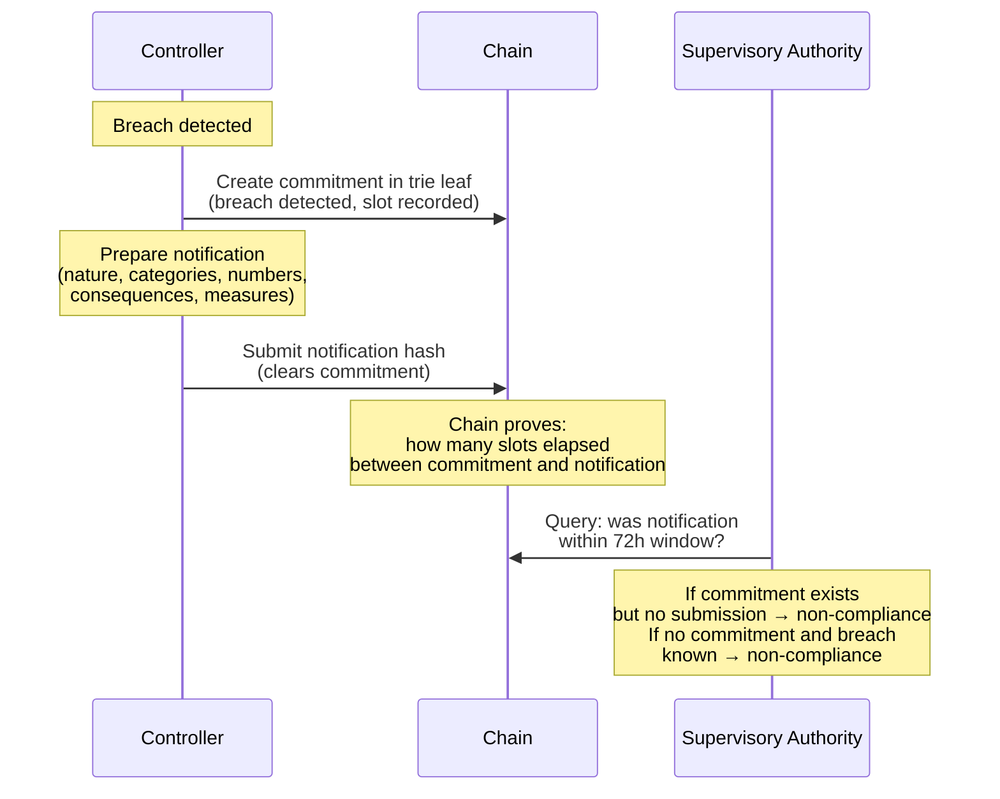
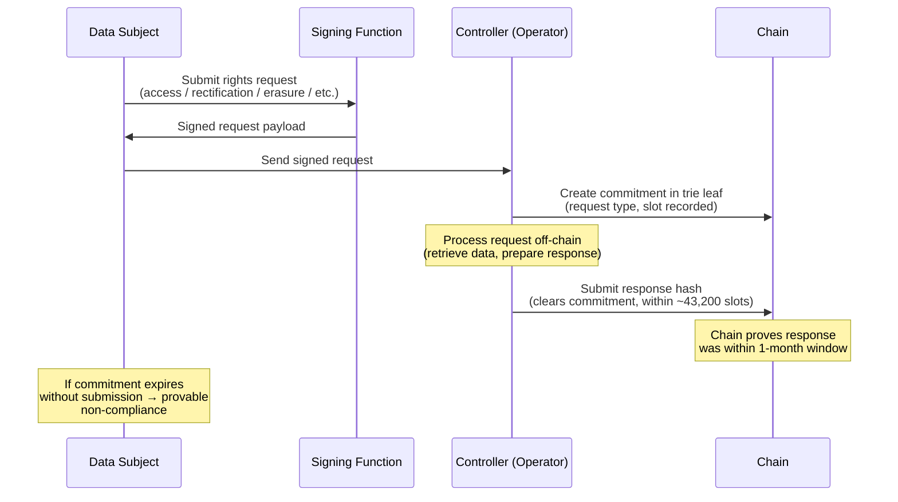
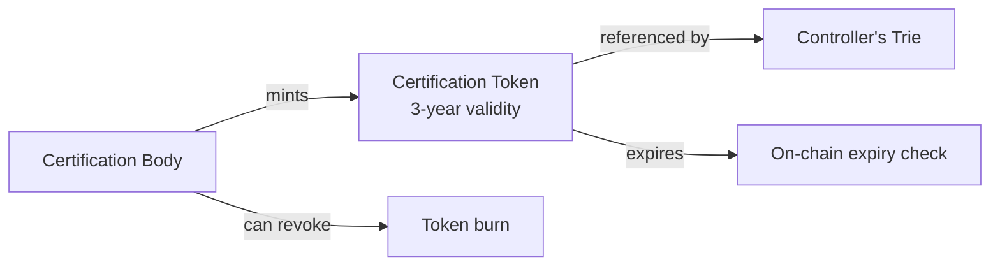

# GDPR

**Regulation:** [(EU) 2016/679][gdpr-full] — General Data Protection Regulation

**Status:** Candidate case — constraint check passed, architecture mapped.
**Smart contract:** [GDPR Smart Contract](gdpr-contract.md) — UTxO diagrams, guard table, lifecycle state machines.

[gdpr-full]: https://eur-lex.europa.eu/eli/reg/2016/679/oj

## The reframing

GDPR does not regulate a product lifecycle. It regulates how organisations
handle personal data. The natural instinct is to ask "can we put personal
data on a blockchain?" — the answer is no, and that is the wrong question.

The right question: **can a blockchain prove that an organisation complied
with GDPR, without storing any personal data on-chain?**

The "items" in the process trie are not data subjects or personal records.
They are **compliance evidence**: consent hashes, breach notification
timestamps, rights-request response proofs, processing activity records,
DPIA attestations. The chain never sees personal data. It sees hashes and
timestamps that prove the controller did what the regulation requires, when
the regulation requires it.

This is pure process mode. No sensors, no physical objects. The trust basis
is protocol enforcement, not hardware attestation.

## Constraint check

| Constraint | Assessment | Notes |
|-----------|-----------|-------|
| **Data cadence** | Pass | Consent events, breach notifications (72h), rights requests (1 month response), DPIAs — all event-driven or periodic. No real-time streaming. |
| **Sequential access** | Pass | Single controller per trie. Rights requests follow a relay: subject → controller → response. Breach: controller → SA. |
| **Liveness** | Pass | Up to €20M / 4% global turnover. 72h breach deadline. 1-month rights response. Strongest penalties of any regulation analysed. |
| **Fee alignment** | Pass | Controllers pay. Compliance cost (~€0.10-0.15 per record) is negligible vs fine exposure. A single breach fine dwarfs lifetime on-chain costs. |
| **Identity delegation** | Pass | Process mode. Data subjects exercise rights through digital channels. The signing function maps to the subject's authenticated request (web portal, app, email verification). |

## Obligation map

| Element | GDPR |
|---------|------|
| **Regulator** | Supervisory authorities (national DPAs), EDPB for cross-border consistency |
| **Obligated parties** | Data controllers, data processors |
| **Reporting obligations** | Processing records ([Art 30][art30]), breach notifications ([Art 33][art33]–[34][art34]), DPIAs ([Art 35][art35]), consent records ([Art 7][art7]), rights-request responses ([Art 12][art12]–22) |
| **Verification bodies** | Supervisory authorities (investigative + corrective powers, [Art 58][art58]), certification bodies ([Art 42][art42]–43) |
| **Beneficiaries** | Data subjects (citizens), society (trust in digital economy) |
| **Penalties** | Tier 1: €10M / 2% turnover. Tier 2: €20M / 4% turnover ([Art 83][art83]). Plus compensation ([Art 82][art82]). Member States may also lay down additional penalties under [Art 84][art84]. |
| **Timeline** | In force since May 2018. No phase-in remaining. |

## Schema mapping

| Schema role | GDPR party | Trie contents |
|-------------|-----------|---------------|
| **Identity provider** | eIDAS / national ID / corporate registry | Attested controller and processor keys |
| **Regulator** | Supervisory authority (DPA) | Controller standing, certification status, enforcement history |
| **Operator** | Data controller | Compliance records: consent hashes, breach notifications, rights responses, Art 30 records |
| **User** | Data subject | Exercises rights via signing function (process mode) |

The processor ([Art 4(8)][art4]) is a secondary operator — they maintain
their own compliance trie, governed by the same smart contract, but their
processing activity is constrained by the controller's documented
instructions. The [Art 28][art28] processing agreement is a static leaf in
both tries, cross-referencing each other.

## Data classification

What goes on-chain is compliance evidence, not personal data.

| Compliance record | Type | Access tier | On-chain |
|-------------------|------|-------------|----------|
| Consent given/withdrawn | Event-driven | Subject + controller | Hash of consent record + timestamp |
| Lawful basis per purpose | Static | Controller + SA | Hash in processing-record leaf |
| Processing activity record ([Art 30][art30]) | Static + updates | Controller + SA on request | Leaf in controller's trie |
| Breach notification to SA | Event-driven, 72h | Controller + SA | Commitment-then-submit |
| Breach notification to subjects | Event-driven | Controller + subjects | Hash + timestamp |
| DPIA conducted | Event-driven | Controller + SA | Attestation hash + timestamp |
| Rights request received | Event-driven | Subject + controller | Commitment (proves receipt time) |
| Rights request fulfilled | Event-driven, 1 month | Subject + controller | Submission clearing commitment |
| Processor agreement ([Art 28][art28]) | Static | Controller + processor | Hash of agreement |
| Certification ([Art 42][art42]) | Static, 3yr validity | Public | Token with expiry |
| Cross-border safeguard | Static + event-driven | Controller + SA | Hash of SCC/BCR/adequacy ref |
| DPO designation | Static | Public | Leaf in controller's trie |

!!! warning "The bright line"
    No personal data — names, identifiers, health data, location, behavioural
    profiles — should ever touch the chain. Not even encrypted. The chain
    stores hashes of compliance records, while the actual records stay
    off-chain under the controller's custody. This materially reduces GDPR
    risk, but it does not automatically take every on-chain hash outside the
    scope of personal data law. Whether a hash is personal data remains a
    context-specific legal question under [Recital 26][rec26], especially if
    linkage data exists off-chain.

## Trust model

| Party A | Party B | Trust | Risk | Mitigation |
|---------|---------|-------|------|------------|
| Controller | Data subject | Low | Controller claims consent existed, subject denies | Immutable timestamped consent hash |
| Controller | SA | Medium | Controller backdates breach notification | Commitment proves on-chain ordering and submission slot once the controller commits |
| Controller | Processor | Medium | Processor claims it followed instructions | On-chain agreement hash, activity proofs |
| Data subject | Controller | Low | Controller ignores rights request | Commitment-then-submit proves response timeline |
| SA | Controller | Medium | Controller presents selective compliance evidence | Completeness via MPT — all records in trie |
| Controller | Controller | None | Portability disputes — who had data when | Transfer records with timestamps |
| Cert body | Controller | Medium | Controller claims valid certification | On-chain token with enforced expiry |

## Value / token identification

| Token | GDPR source | Behaviour |
|-------|-------------|-----------|
| **Consent record** | [Art 7][art7] | Created on consent, updated on withdrawal. Proves existence at any point. |
| **Certification seal** | [Art 42][art42] | Issued by accredited body, 3-year validity, renewable. Revocable. |
| **Rights-request ticket** | [Art 12][art12]–22 | Created on request, must be resolved within deadline. Commitment pattern. |
| **Breach receipt** | [Art 33][art33] | Proves the submission slot and on-chain ordering of the notification. One-shot commitment. |
| **Adequacy attestation** | [Art 44][art44]–49 | Reference to transfer safeguard. Static until revoked. |

## Protocol patterns

### Breach notification (72 hours) — the flagship

This is where blockchain adds the most obvious value. Today controllers
self-report breach timing. There is no neutral witness.



The commitment protocol turns part of the 72-hour rule from a self-reported
claim into a verifiable on-chain fact. It proves when the controller
committed and when it later submitted the notification hash. It does not, by
itself, prove the exact off-chain moment when the controller first became
aware of the breach. The absence of a timely commitment, when a breach
becomes known through other channels, is still evidence of possible
non-compliance.

### Rights-request response (1 month)



Complex requests can extend to 3 months ([Art 12(3)][art12]). The commitment window
reflects this — the controller creates a second commitment with the
extended deadline and notifies the subject within the first month.

### Consent lifecycle

```
None → Given → Withdrawn
```

Each transition is a leaf update in the controller's trie. The chain proves:

- **When** consent was given (slot timestamp)
- **For what purpose** (hash of purpose description — not the purpose itself)
- **When** it was withdrawn
- **That** processing stopped after withdrawal (no further activity leaves
  referencing that consent hash after withdrawal slot)

The data subject never needs a wallet. They interact through the controller's
portal. The signing function is the authenticated session.

### Processing records ([Art 30][art30])

The controller maintains [Art 30][art30] records as leaves in their trie:

- Purposes of processing
- Categories of data subjects and personal data
- Categories of recipients
- Transfers to third countries
- Envisaged erasure time limits
- Security measures description

All stored as hashes. The SA queries the trie root via reference input. On
audit, the controller produces the pre-images. If a hash matches, the
record is proved authentic and timestamped.

### Certification ([Art 42][art42])



The certification body is an authorised party in the regulation trie. The
token minting policy reads the certification body's qualification from the
regulation trie. The token carries an expiry slot. The controller references
it in their compliance trie. Expired or revoked tokens cannot be referenced
in new compliance submissions.

## The GDPR–blockchain tension — and why it does not apply here

The literature identifies fundamental conflicts between GDPR and blockchain.
Every one of them concerns storing **personal data** on-chain. This
architecture stores **compliance evidence** on-chain — a different category.

| Tension | Standard framing | This architecture |
|---------|-----------------|-------------------|
| **Immutability vs erasure ([Art 17][art17])** | Cannot delete on-chain personal data | No personal data on-chain. Compliance records are not subject to erasure — they are the controller's proof of accountability. |
| **Immutability vs rectification ([Art 16][art16])** | Cannot correct on-chain records | Compliance records are appended (new leaf for correction). The history of corrections is itself evidence of accountability. |
| **Storage limitation ([Art 5(1)(e)][art5])** | On-chain data persists forever | Compliance records have legitimate retention: legal obligation ([Art 6(1)(c)][art6]) and legal claims defence ([Art 17(3)(e)][art17]). |
| **Data minimisation ([Art 5(1)(c)][art5])** | Full node replication | Only hashes on-chain. Minimal by design. |
| **Controller designation** | Who is the controller on a public chain? | Clear: the data controller is the operator of their own trie. Identity provider, SA, and validators are not controllers of compliance data. |
| **Cross-border transfers ([Art 44][art44]–49)** | Nodes worldwide = transfer to every jurisdiction | On-chain data is hashes of compliance records, not personal data. No personal data crosses borders via the chain. |
| **Automated decision-making ([Art 22][art22])** | Smart contracts make autonomous decisions | The smart contract validates format and timing. It does not make decisions about data subjects. |
| **Legal basis** | No clean basis for on-chain personal data | Legal obligation ([Art 6(1)(c)][art6]) — the controller is required to maintain and demonstrate compliance records. |

The architecture resolves the tension by staying on the right side of the
bright line: personal data off-chain, compliance proof on-chain. This
aligns with [CNIL's 2018 blockchain guidance][cnil-blockchain], which
recommends off-chain storage with on-chain commitment schemes as the
primary GDPR-compatible pattern.

## Formal invariants

| Invariant | Meaning | Lean statement |
|-----------|---------|---------------|
| Breach timeliness | Notification within 72h of commitment | `breachSubmit leaf → leaf.submitSlot - leaf.commitSlot ≤ 72h_in_slots` |
| Rights response timeliness | Response within 1 month of commitment | `rightsResponse leaf → leaf.responseSlot - leaf.requestSlot ≤ 1month_in_slots` |
| Consent monotonicity | Withdrawn consent not re-given for same purpose without new event | `withdrawConsent leaf → ¬(restoreConsent leaf same_purpose)` |
| Certification validity | Expired tokens cannot be referenced | `referenceCert token → token.expirySlot > currentSlot` |
| Commitment single-use | Each commitment cleared exactly once | `submitResponse leaf → leaf.commitment = none` |
| Processing record completeness | All mandatory Art 30 fields present | `createProcessingRecord leaf → hasAllMandatoryFields leaf` |

## Economics

| Operation | Frequency | L1 cost | At scale (1000 controllers) |
|-----------|-----------|---------|---------------------------|
| Controller registration | Once | ~0.2 ADA | Negligible |
| Consent record (leaf insert) | Per consent event | ~0.15 ADA | Volume × unit cost |
| Breach commitment | Per breach | ~0.2 ADA | Rare events |
| Breach notification submit | Per breach | ~0.15 ADA | Rare events |
| Rights request commitment | Per request | ~0.15 ADA | Moderate volume |
| Rights response submit | Per response | ~0.15 ADA | Moderate volume |
| Art 30 record update | Per processing change | ~0.15 ADA | Low frequency |
| Certification token mint | Per certification | ~0.3 ADA | Every 3 years |
| Root anchor | Per batch | ~0.2 ADA | Fixed, amortised |
| Verification (query) | Per audit query | Free (off-chain) | Zero marginal cost |

A medium-sized controller processing 1000 consent events/year, 10 rights
requests/month, and rare breach notifications would spend ~€50-100/year in
on-chain fees. A single GDPR fine (median ~€50,000 for SMEs, millions for
large companies) makes this negligible.

The value proposition is not cost savings — it is **proof**. The controller
can prove to any court, SA, or data subject when a compliance action was
anchored on-chain, with neutral evidence of inclusion and slot ordering that
neither party produced unilaterally.

## Comparison with Battery Regulation

| Dimension | Battery Regulation | GDPR |
|-----------|-------------------|------|
| Mode | Physical (sensor + secure element) | Process (server-side signing functions) |
| Items in trie | Batteries (physical products) | Compliance records (abstract evidence) |
| Key hardware | NFC + SE050 | None — pure software |
| Data on-chain | Product data hashes (SoH, composition) | Compliance evidence hashes (consent, breach timing) |
| Primary value | Provenance and tamper-proof readings | Temporal proof and accountability |
| User interaction | Tap a battery | Submit a request through a portal |
| Relay pattern | Manufacturer → transporter → consumer | Subject → controller → SA |
| Flagship protocol | SoH reading (commitment-then-submit) | 72h breach notification (commitment-then-submit) |
| Scale | ~5M batteries/year | ~100K+ controllers, millions of events |

## Open questions

1. **SA adoption** — SAs are public authorities with limited technical
   capacity. The regulator role requires maintaining a regulation trie and
   publishing a smart contract. Who builds and maintains this for them?

2. **Cross-border consistency** — GDPR has 27+ national SAs with a
   consistency mechanism (EDPB). Does each SA maintain its own regulation
   trie, or is there a shared EU-level trie? The lead authority mechanism
   ([Art 56][art56]) suggests a federated model.

3. **Processor chains** — [Art 28][art28] allows sub-processors. The
   processor agreement chain (controller → processor → sub-processor)
   creates multi-level trie references. How deep can this go efficiently?

4. **Joint controllers** — [Art 26][art26] allows joint controller
   arrangements. Two or more controllers sharing a trie, or
   cross-referencing separate tries? The arrangement must be transparent
   to data subjects.

5. **Hash-as-personal-data risk** — the argument that on-chain hashes are
   not personal data holds only if the controller's off-chain data is
   properly segregated. If an attacker compromises both the chain data and
   the controller's database, hashes become linkable. This is a security
   boundary, not an architectural one, but it must be addressed.

6. **Consent withdrawal and processing cessation** — the chain can prove
   when consent was withdrawn. But can it prove that processing *stopped*?
   This requires the absence of certain leaf updates after a given slot —
   provable by MPT completeness, but subtle.

## Sources

### Primary legislation

- [Regulation (EU) 2016/679][gdpr-full] — full GDPR text (EUR-Lex consolidated version)
- [Art 4][art4] — definitions (personal data, controller, processor, consent, pseudonymisation)
- [Art 5][art5] — principles (lawfulness, purpose limitation, minimisation, accuracy, storage limitation, integrity, accountability)
- [Art 6][art6] — lawful bases for processing
- [Art 7][art7] — conditions for consent
- [Art 9][art9] — special categories of personal data
- [Art 12][art12] — modalities for exercising data subject rights (1-month / 3-month timeline)
- [Art 15][art15] — right of access
- [Art 16][art16] — right to rectification
- [Art 17][art17] — right to erasure ("right to be forgotten")
- [Art 20][art20] — right to data portability
- [Art 22][art22] — automated individual decision-making, including profiling
- [Art 25][art25] — data protection by design and by default
- [Art 26][art26] — joint controllers
- [Art 28][art28] — processor obligations and processing agreements
- [Art 30][art30] — records of processing activities
- [Art 33][art33] — notification of breach to supervisory authority (72 hours)
- [Art 34][art34] — communication of breach to data subject
- [Art 35][art35] — data protection impact assessment (DPIA)
- [Art 42][art42] — certification
- [Art 44–49][art44] — transfers to third countries (adequacy, SCCs, BCRs, derogations)
- [Art 56][art56] — lead supervisory authority (cross-border)
- [Art 58][art58] — supervisory authority powers
- [Art 82][art82] — right to compensation
- [Art 83][art83] — administrative fines (€10M/2% and €20M/4% tiers)
- [Art 84][art84] — criminal penalties
- [Recital 26][rec26] — definition of anonymous data and the "means reasonably likely" test

[art4]: https://gdpr-info.eu/art-4-gdpr/
[art5]: https://gdpr-info.eu/art-5-gdpr/
[art6]: https://gdpr-info.eu/art-6-gdpr/
[art7]: https://gdpr-info.eu/art-7-gdpr/
[art9]: https://gdpr-info.eu/art-9-gdpr/
[art12]: https://gdpr-info.eu/art-12-gdpr/
[art15]: https://gdpr-info.eu/art-15-gdpr/
[art16]: https://gdpr-info.eu/art-16-gdpr/
[art17]: https://gdpr-info.eu/art-17-gdpr/
[art20]: https://gdpr-info.eu/art-20-gdpr/
[art22]: https://gdpr-info.eu/art-22-gdpr/
[art25]: https://gdpr-info.eu/art-25-gdpr/
[art26]: https://gdpr-info.eu/art-26-gdpr/
[art28]: https://gdpr-info.eu/art-28-gdpr/
[art30]: https://gdpr-info.eu/art-30-gdpr/
[art33]: https://gdpr-info.eu/art-33-gdpr/
[art34]: https://gdpr-info.eu/art-34-gdpr/
[art35]: https://gdpr-info.eu/art-35-gdpr/
[art42]: https://gdpr-info.eu/art-42-gdpr/
[art44]: https://gdpr-info.eu/art-44-gdpr/
[art56]: https://gdpr-info.eu/art-56-gdpr/
[art58]: https://gdpr-info.eu/art-58-gdpr/
[art82]: https://gdpr-info.eu/art-82-gdpr/
[art83]: https://gdpr-info.eu/art-83-gdpr/
[art84]: https://gdpr-info.eu/art-84-gdpr/
[rec26]: https://gdpr-info.eu/recitals/no-26/

### CJEU case law

- [C-582/14 Breyer v Germany][breyer] — dynamic IP addresses as personal data;
  broad interpretation of "identifiable" person even when identification
  requires third-party data
- [C-311/18 Schrems II][schrems2] — invalidation of EU-US Privacy Shield;
  requirement for transfer impact assessments alongside SCCs
- [C-362/14 Schrems I][schrems1] — invalidation of Safe Harbor; adequacy
  decisions can be challenged

[breyer]: https://curia.europa.eu/juris/liste.jsf?num=C-582/14
[schrems2]: https://curia.europa.eu/juris/liste.jsf?num=C-311/18
[schrems1]: https://curia.europa.eu/juris/liste.jsf?num=C-362/14

### Regulatory guidance

- [EDPB Guidelines on Data Protection by Design and by Default][edpb-design]
  (version 2.0, 2020) — practical requirements for Art 25 implementation
- [Article 29 Working Party Opinion 05/2014 on Anonymisation Techniques][wp216]
  — the three criteria for effective anonymisation (singling out, linkability,
  inference) and why pseudonymised data remains personal data
- [CNIL Blockchain and GDPR guidance][cnil-blockchain] (2018) — the French
  SA's position on controller designation in blockchain systems, smart contract
  deployers as potential controllers, and recommended mitigations (off-chain
  storage, commitment schemes, encryption with key destruction)
- [EU-US Data Privacy Framework adequacy decision][dpf] (2023) — current
  transatlantic transfer mechanism replacing Privacy Shield

[edpb-design]: https://www.edpb.europa.eu/our-work-tools/our-documents/guidelines/guidelines-42019-article-25-data-protection-design-and_en
[wp216]: https://ec.europa.eu/justice/article-29/documentation/opinion-recommendation/files/2014/wp216_en.pdf
[cnil-blockchain]: https://www.cnil.fr/en/blockchain-and-gdpr-solutions-responsible-use-blockchain-context-personal-data
[dpf]: https://commission.europa.eu/law/law-topic/data-protection/international-dimension-data-protection/eu-us-data-transfers_en

### GDPR enforcement data

- [GDPR Enforcement Tracker][enforcement] — database of fines issued by
  EU supervisory authorities (used for median fine estimates in the
  economics section)

[enforcement]: https://www.enforcementtracker.com/
