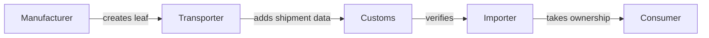

# The Five Constraints

These constraints determine whether a regulation is a good candidate for
blockchain-based compliance infrastructure. All five must hold. If any fails,
a traditional database with audit logs likely suffices.

## 1. Data cadence

**The regulation's data update rhythm must be compatible with L1 settlement.**

Blockchain transactions are not instantaneous. Even on fast L1s, there is
a settlement window measured in seconds to minutes, and batching makes
economic sense at intervals of hours to days.

This is fine when the regulation requires:

- **Periodic reporting** — quarterly carbon declarations, annual recycling
  targets, monthly SoH snapshots
- **Event-driven updates** — ownership transfer, repurposing, end-of-life
  declaration, recall notification
- **Batch submissions** — operator aggregates readings from the field and
  submits daily

This does **not** fit when:

- Real-time sensor telemetry must be continuously anchored (100ms intervals)
- Sub-second latency matters for the compliance outcome
- The data volume per time unit exceeds L1 throughput even with batching

!!! note "The Merkle Patricia Trie helps"
    The MPT-per-operator pattern means each operator submits one transaction
    per batch, regardless of how many items were updated. A manufacturer
    updating 10,000 batteries pays for one root hash update, not 10,000
    individual transactions.

## 2. Sequential access

**Writes to the shared state must be naturally serialized — no concurrent
contention on the same data structure.**

A Merkle Patricia Trie stored in a single UTxO is inherently sequential:
only one transaction can consume and recreate it per block. This is a feature,
not a limitation, when the regulation's own structure serializes access.

### Single operator pattern

The most common case: the regulation assigns responsibility to one party
(manufacturer, importer, economic operator) who is the sole writer for their
own data. No contention by design.

### Relay pattern

Multiple actors write to the same trie, but in sequence. The regulation
defines the ordering:

Each step is a state transition. Actor B cannot act until actor A has
completed their step. The regulation **is** the state machine — we are
not imposing sequentiality, we are mirroring it.

### When it breaks

- Multiple independent operators need to write to a **shared** trie
  simultaneously (use separate tries instead)
- Auction or exchange dynamics where many parties compete to update the
  same state in the same block (use a different pattern entirely)

## 3. Liveness

**The regulation must provide deadlines and penalties that incentivize
continued participation, or the protocol must have timeout/escalation paths.**

The relay pattern from constraint 2 has an inherent risk: if one actor
stops participating, the chain stalls. The regulation mitigates this in
two ways:

### Regulatory incentive

The regulation imposes deadlines and penalties. An operator who fails to
submit data within the required window faces:

- Fines (e.g., Battery Regulation penalties under Art. 93)
- Market withdrawal of their products
- Loss of operating license
- Possible criminal liability where national law provides it

This is external liveness — the legal system provides the incentive.

### Protocol escalation

On-chain mechanisms can complement regulatory penalties:

- **Slot-based timeouts** — if an actor doesn't act within N slots, the
  next actor in the relay can skip them or escalate
- **Bond/deposit** — operators lock collateral that is slashed on timeout
- **Fallback operator** — a designated backup can process stalled items

!!! warning "v1 vs v2"
    In the cooperative model (v1), liveness depends on the operator's
    good faith, backed by regulatory penalties. The adversarial model (v2)
    adds on-chain enforcement but increases complexity and cost.

## 4. Fee alignment

**There must be an actor who benefits enough from on-chain compliance to
pay for it — the sponsor.**

Users will not pay per action. Blockchain transactions cost money, but the
cost must not leak through to the user. The entity that benefits from the
on-chain guarantees sponsors the transactions. The regulation creates this
economic incentive — compliance is compulsory, and sponsoring on-chain
activity is the cheapest way to comply.

### Who pays and why

| Actor | Pays because | Example |
|-------|-------------|---------|
| **Manufacturer** | Compliance is cheaper than fines | Battery passport updates |
| **Importer** | Market access requires it | CBAM certificate purchases |
| **Operator** | Competitive advantage from certified data | SoH verification for resale |
| **Institution** | Public good infrastructure | National registry anchoring |

### The user doesn't pay

In most regulatory contexts, the end user (citizen, consumer, field worker)
should not need a wallet, ADA, or any blockchain knowledge. The operator
absorbs the cost because:

- The regulation mandates them, not the user
- The cost per operation is negligible at scale (~$0.10-0.15 per update)
- The compliance benefit far exceeds the transaction cost

### Happy path vs sad path

**Happy path (cooperative):** The operator pays willingly because compliance
is valuable. Users interact through the operator's infrastructure.

**Sad path (adversarial):** The operator refuses to act. Now the user needs
leverage:

- On-chain escrow — operator locked a bond; timeout triggers penalty
- Direct submission — user can force a state transition (requires wallet)
- Regulatory complaint — off-chain, but the on-chain record proves the
  operator's failure

The happy path should be cheap and frictionless. The sad path should exist
as a deterrent, even if rarely used.

## 5. Identity delegation

**Actors who will never have wallets must be able to make meaningful
on-chain state transitions through cryptographic proxies.**

Regulations apply to everyone — manufacturers, transport workers, recyclers,
consumers. These people will not install a Cardano wallet. But they need
to perform actions that result in on-chain state changes.

### The proxy pattern

A physical object or institutional credential carries a key pair that
acts on the user's behalf:

| Proxy | How it works | Example |
|-------|-------------|---------|
| **Secure element in product** | NFC tap triggers SE050 to sign a reading | Battery SoH check |
| **Institutional smart card** | Employee badge signs an inspection attestation | Factory audit |
| **Mobile credential** | Phone app holds a delegated key from the operator | Field data collection |
| **QR + challenge** | Scan triggers a time-bounded commitment | Product verification |

### What the proxy proves

The proxy bridges the physical world to the chain:

1. **This specific human** performed **this specific action** (tap, scan, present)
2. **At this specific time** (commitment window on-chain)
3. **On this specific item** (leaf in the operator's trie)
4. The human never knew about blockchain, UTxOs, or ADA

### Hardware requirements

For the proxy to work on-chain, it must:

- Use a curve with **native Plutus built-in support** (Ed25519, secp256k1)
- Produce **deterministic signatures** (COSE_Sign1/CBOR, not JSON)
- Be **tamper-resistant** (secure element, not software key)
- Be **powered by the interaction** (NFC energy harvesting, no battery)

!!! note "This is what makes blockchain accessible to regulation"
    Regulations apply to millions of people who will never be crypto users.
    The delegation pattern is the bridge. Without it, blockchain remains
    a tool for crypto-native participants only.

## The three-question pre-filter

Before running the full five constraints, apply this quick filter:

1. **Multi-party data?** — Multiple independent parties must share a common
   data set, and no single party should control it.
2. **Institutional anchor?** — An institution defines what's valid but
   doesn't want to run the infrastructure.
3. **Verifiable history?** — Historical integrity matters — parties must
   not be able to rewrite past records.

If all three hold → proceed with the five constraints.
If only 1-2 hold → a traditional database with audit logs may suffice.

## Tie-breaker: unlinkability requirement

Some regulations pass all five constraints but seem marginal — a traditional
database with strong access controls could arguably suffice. The deciding
factor may be **unlinkability**: does the regulation require that the operator
cannot correlate a user's actions across interactions?

If yes, no traditional database achieves this. The operator runs the database
and can always query it. Access control policies can be circumvented by the
administrator. Only cryptographic unlinkability — where correlation is
mathematically impossible, not just forbidden — satisfies the requirement.

Pairing-based anonymous credentials (BBS+) on Cardano provide this. See the
[unlinkable authorization pattern](patterns.md#unlinkable-authorization-via-anonymous-credentials)
for details.

This makes the unlinkability requirement a tie-breaker: when the five
constraints are met but the case for blockchain over a database is weak,
a regulation that demands unlinkability tips the balance decisively toward
on-chain infrastructure.
