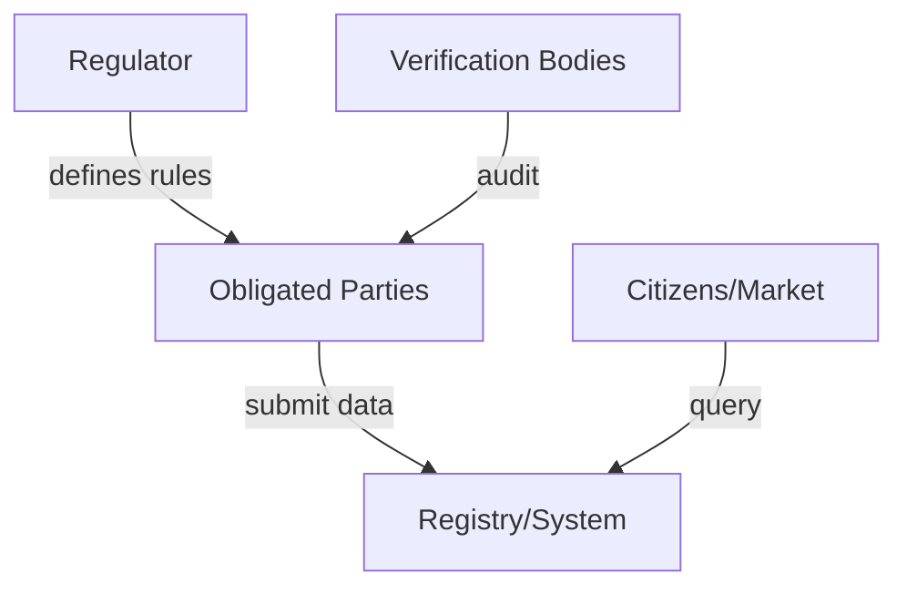

# Analysis Methodology

A step-by-step process for decomposing a regulation into blockchain-ready
patterns. Apply the [five constraints](constraints.md) first — if they hold,
use this methodology to design the architecture.

## Phase 1: Regulatory decomposition

### 1.1 Obligation map

Read the regulation text and extract:

| Element | Question |
|---------|----------|
| **Regulator** | Who sets the rules? |
| **Obligated parties** | Who must comply? |
| **Reporting obligations** | What data must be produced? |
| **Verification bodies** | Who checks compliance? |
| **Beneficiaries** | Who benefits from transparency? |
| **Penalties** | What happens on non-compliance? |
| **Timeline** | When do obligations start? |

### 1.2 Data classification

For each reporting obligation, classify:

- **Static** — set once at creation (e.g., chemistry, manufacturer, footprint)
- **Dynamic** — changes over lifetime (e.g., state of health, ownership)
- **Event-driven** — triggered by lifecycle events (repurposing, recycling)
- **Access-tiered** — different visibility per audience (public / authorized /
  authority-only)

### 1.3 Interaction graph

Map the parties and what flows between them:



Identify:

- Where does **value** flow? (certificates, credits, payments)
- Where does **trust** flow? (attestations, signatures, proofs)
- Where is there **asymmetric information**? (one party knows more)

## Phase 2: Trust boundary analysis

For each pair of parties, assess:

| Party A | Party B | Trust? | Risk | Blockchain mitigates? |
|---------|---------|--------|------|----------------------|
| Manufacturer | Consumer | Low | Data manipulation | Yes — immutable history |
| Manufacturer | Regulator | Medium | Selective reporting | Yes — completeness proofs |
| Consumer | Consumer | None | Counterfeit resale | Yes — provenance chain |

The trust table reveals where blockchain adds value. Pairs with high mutual
trust don't need on-chain verification.

## Phase 3: Value/token identification

Look for things that behave like tokens:

| Type | Characteristics | Example |
|------|----------------|---------|
| **Certificates** | Issued, transferred, surrendered | CBAM certificates |
| **Credits** | Accumulated, tradeable | Carbon credits, recycling credits |
| **Rights** | Granted, revoked | Reading rights, access rights |
| **Obligations** | Created, discharged | Due diligence statements |
| **Rewards** | Earned through participation | Reporter incentives |

These are candidates for on-chain representation, either as native tokens
or as fields in MPT leaves.

## Phase 4: Architecture design

### Storage pattern selection

| Pattern | When to use | Cost profile |
|---------|-------------|-------------|
| **One UTxO per item** | < 10K items, each independently traded | High min-UTxO |
| **MPT per operator** | 100K+ items, operator-centric regulation | Low (one UTxO per operator) |
| **Batched commitments** | High volume, periodic reporting | Medium |
| **L2 (Hydra)** | > 1M items, real-time updates | Near-free per tx |

**Rule of thumb:** If the regulation assigns responsibility to *operators*
(not items), MPT-per-operator is almost always right.

### Protocol pattern matching

| Pattern | Regulation signal | Implementation |
|---------|------------------|----------------|
| **Commitment-then-submit** | "Must occur within time window" | On-chain slot-bounded commitment |
| **Operator-as-aggregator** | "Economic operator is responsible" | Operator batches, users have no wallet |
| **Lifecycle state machine** | "Status changes on events" | Leaf enum field |
| **Tiered access** | "Different access levels" | On-chain root, off-chain encrypted layers |
| **Reward distribution** | "Incentivize data collection" | Monotonic accumulator in leaf |
| **Cross-operator handoff** | "Responsibility transfers" | New leaf in new trie, back-link |

## Phase 5: Economics

### Cost model

| Operation | Frequency | L1 cost | At scale |
|-----------|-----------|---------|----------|
| Operator registration | Once | ~0.2 ADA | Negligible |
| Item creation (leaf insert) | Per product | ~0.15 ADA batched | Volume x unit |
| Dynamic data update | Per event | ~0.10-0.15 ADA | Dominant cost |
| Root anchor | Per batch | ~0.2 ADA | Fixed, amortized |
| Verification query | Per query | Free (off-chain) | Zero marginal |

### Break-even question

Compare against:

- Centralized database with audit log
- Permissioned blockchain
- Other L1s

Blockchain wins when: **trust cost > infrastructure cost**. If all parties
already trust each other, use a database.

## Phase 6: Formal invariants

For each protocol pattern, state what must hold:

| Pattern | Invariant |
|---------|-----------|
| Commitment-then-submit | Commitment cleared after submission |
| Reward distribution | Rewards never decrease |
| MPT update | Tree remains consistent |
| Lifecycle | No backward transitions |
| Cross-operator handoff | Old leaf becomes read-only |

**Rule:** If you can't state the invariant precisely, the protocol design
is incomplete. Go back to Phase 4.

## Deliverable structure

For each regulation analyzed, the output follows this structure:

```
regulation-name/
├── docs/
│   ├── regulation.md      # Regulatory landscape, timelines, penalties
│   ├── data-model.md      # Schema, field classification
│   ├── architecture.md    # On-chain design, protocol patterns
│   ├── trust-model.md     # Trust boundaries, cooperative vs adversarial
│   └── costs.md           # Economics at various scales
├── proofs/                # Lean 4 invariant proofs
├── haskell/               # Canonical type definitions
└── aiken/                 # Validators (from generated vectors)
```
