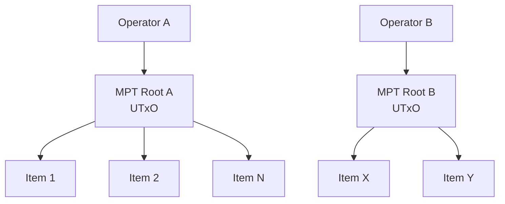
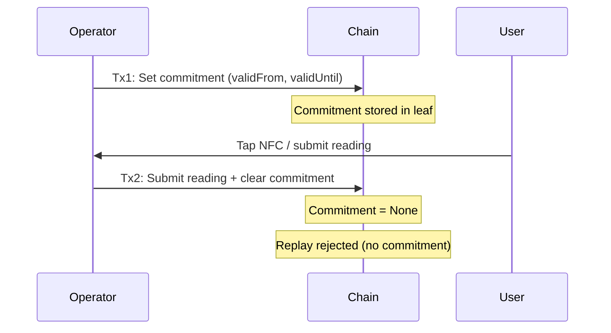
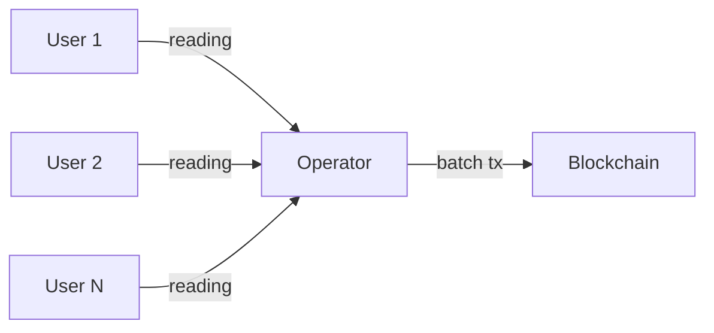
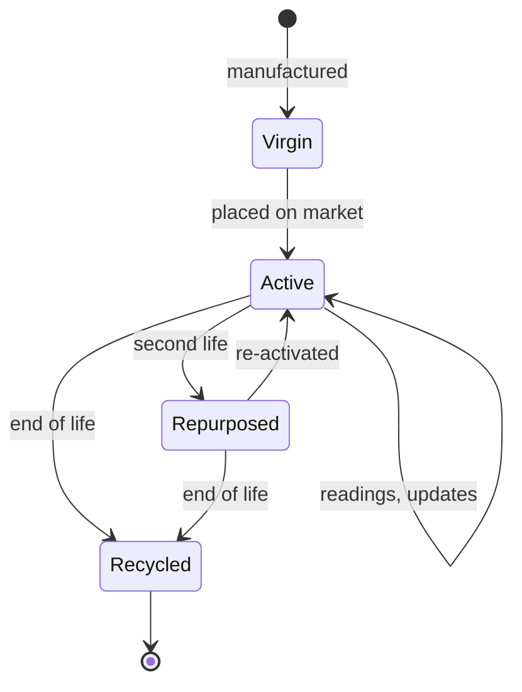
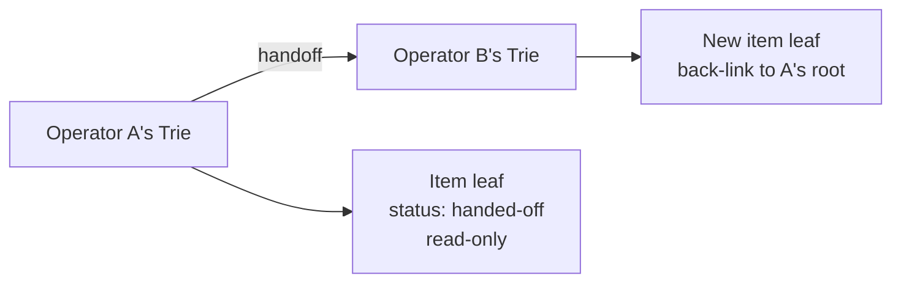
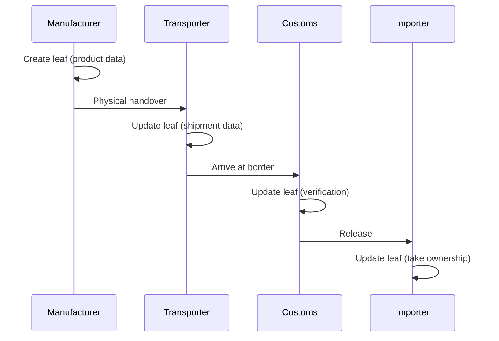
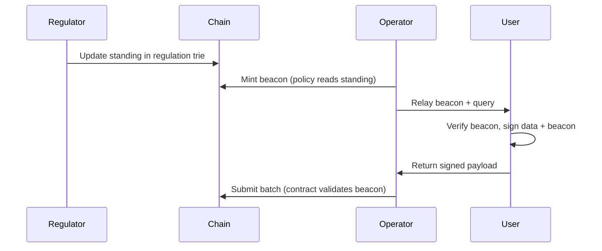
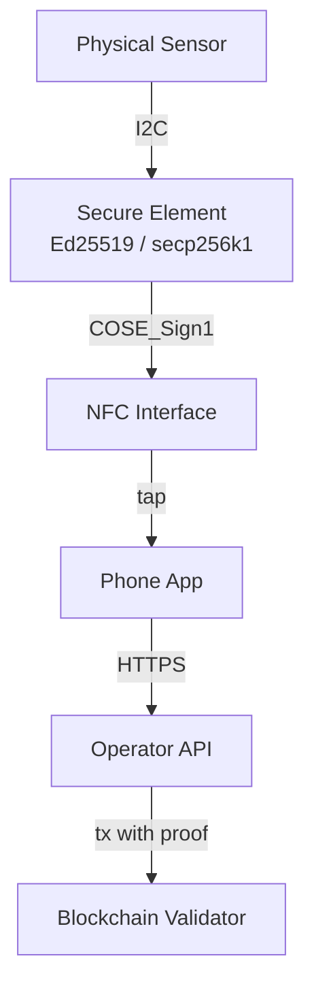

# Architecture Patterns

Reusable on-chain patterns extracted from the EU Digital Product Passport
work. Each pattern addresses a specific class of regulatory requirement.

## MPT-per-operator

**When:** The regulation assigns responsibility to economic operators, each
managing many items.

**Properties:**

- One UTxO per operator, regardless of item count
- Operator is the sole writer — no contention
- Items are leaves; updates recompute the root
- Cost scales with operators (~100s), not items (~millions)

**Constraint fit:**

- Data cadence: operator batches updates periodically
- Sequential access: one writer per trie
- Fee alignment: operator pays for their own trie
- Identity delegation: items carry proxy keys, operator submits on behalf

## Commitment-then-submit

**When:** The regulation requires proving that an action occurred within a
specific time window.

**Properties:**

- On-chain commitment acts as a trusted clock
- Single-use: cleared on submission, prevents replay
- Slot-bounded: validator checks `validFrom <= slot <= validUntil`
- No off-chain timestamp trust needed

**Invariant:** After submission, `leaf.commitment = none`. Formally proved.

## Operator-as-aggregator

**When:** Users must interact with the blockchain but cannot have wallets.

**Properties:**

- Users have zero blockchain presence — no wallet, no ADA, no keys
- Operator collects actions and batches them into transactions
- The operator pays all fees (compliance is their incentive)
- Happy path: cooperative. Sad path: user escalates via bond/timeout

**Key design:** The user's action is authenticated not by a wallet signature
but by a **proxy credential** (NFC secure element, institutional badge,
delegated key). The operator includes this proof in the transaction.

## Lifecycle state machine

**When:** The regulation defines product/item status transitions.

**Properties:**

- Status is a field in the MPT leaf
- Transitions are validated on-chain (no backward transitions)
- Each transition may change the responsible operator
- Historical states are preserved in the trie's audit trail

**Invariant:** `transition(s1, s2) → ord(s2) >= ord(s1)`. No backward
transitions except explicitly allowed ones (e.g., repurposed → active).

## Reward distribution

**When:** The regulation benefits from incentivizing third-party data
collection.

**Properties:**

- Reporters accumulate rewards in a monotonically increasing counter
- Each valid reading adds to the reporter's accumulated total
- Rewards are stored in the MPT alongside item data
- Withdrawal is a separate transaction (operator funds the pool)

**Invariant:** `credit(reporter, reward) → reporter'.accumulated > reporter.accumulated`
for any `reward > 0`. Formally proved.

## Cross-operator handoff

**When:** The regulation transfers responsibility between parties (resale,
repurposing, import/export).

**Properties:**

- Old leaf becomes read-only in the originating trie
- New leaf is created in the receiving operator's trie
- Back-link to the original root preserves provenance
- Full history is verifiable across both tries

## Relay state machine

**When:** Multiple actors must act in sequence, each contributing their
part to the compliance record.

**Properties:**

- The regulation defines the actor ordering
- Each actor can only act when it's their turn
- Timeout/escalation if an actor doesn't act within deadline
- The trie serializes access naturally — no contention because the
  regulation already requires sequential processing

## Beacon-gated attestation

**When:** The regulation requires the user to see the operator's current
compliance status before contributing data.

**Properties:**

- Operator cannot collect attestations without a current beacon
- Minting policy forces inclusion of operator's standing from regulation trie
- Beacon has bounded validity — no stale reputation
- User signs over the beacon — informed consent by construction
- The user needs only the regulator's published beacon policy identifier
  and trust anchor to verify the beacon

**Invariant:** A batch submission is rejected if it includes a beacon whose
expiry has passed or whose standing hash doesn't match the regulation trie
at mint time.

## Identity delegation via hardware

**When:** Non-crypto actors must make on-chain state transitions.

**Hardware requirements:**

| Component | Role | Constraint |
|-----------|------|-----------|
| Sensor | Measures physical state | Analog — tamper is expensive |
| Secure element | Signs with private key | Key never leaves chip |
| NFC interface | Bridges to phone | Powered by phone's field |
| Validator | Verifies signature on-chain | Must use Plutus built-in curve |

**Supported curves:** Ed25519 and secp256k1 have native Plutus built-in
verifiers. P-256/P-384 do not — avoid hardware that only supports NIST
curves.
