# The Regulator Schema

How a regulator can use Cardano to enforce a multi-party regulation without
running infrastructure, managing identities, or trusting any single operator.

## Four parties, four concerns

A regulated process involves four independent parties. Each manages one
concern and trusts no other party beyond what the chain enforces.

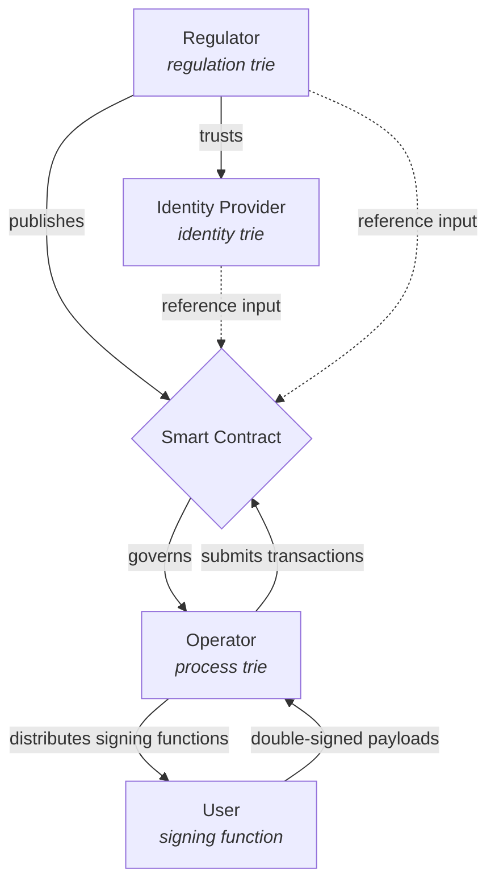

| Party | Trie | Contains | Responsibility |
|-------|------|----------|----------------|
| **Identity provider** | Identity trie | Attested actor public keys | Who exists as a verified entity |
| **Regulator** | Regulation trie | Actor qualifications for this regulation | Who is qualified to participate |
| **Operator** | Process trie | Items, processes, state | What is happening |
| **User** | — | Just acts via signing function | Performing regulated actions |

No overlap. The identity provider doesn't know about processes. The regulator
doesn't run infrastructure. The operator can't fake users. The user doesn't
need to trust anyone.

The **smart contract** is the regulation in executable form — published by
the regulator, it governs the operator's trie and reads both the identity trie
and regulation trie as reference inputs. The regulator audits that operators
use the correct smart contract and follows the transactions over it.

## The on-chain architecture

Four Merkle Patricia Tries, four UTxOs, and a smart contract that ties
them together.

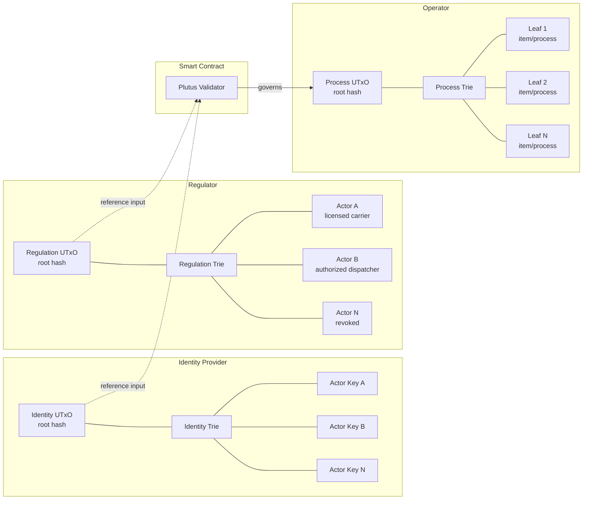

| Trie | Owner | Contains | Role |
|------|-------|----------|------|
| **Identity trie** | identity provider | Attested actor public keys | Who exists as a verified real-world entity |
| **Regulation trie** | Regulator | Actor qualifications specific to this regulation | Who is qualified to act in this regulated process |
| **Process trie** | Operator | Items, processes, leaves with state | What is happening |
| **Commitment** | Inside each process leaf | Slot windows, expected actions | When and how actions occur |

Both the identity trie and the regulation trie are **reference inputs** —
read-only from the operator's perspective. The operator never spends them.
The smart contract reads them at validation time to verify that the actor
submitting a state transition is both an attested real-world entity (identity)
and qualified for this specific regulation (regulation trie).

## On-chain and off-chain verification

Privacy requires splitting verification across two layers:

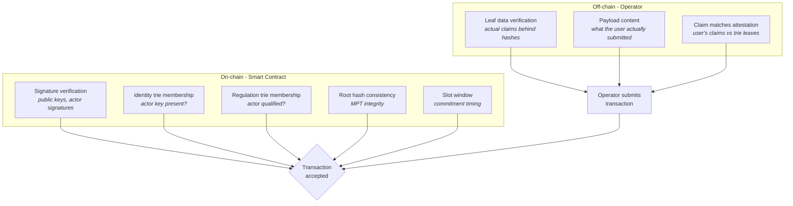

**On-chain**: the smart contract verifies what's public — signatures, public
keys (actor in identity trie, actor qualified in regulation trie), commitment
windows, root hash consistency. All it sees are hashes and signatures.

**Off-chain**: the operator verifies the actual leaf data — the claims behind
the hashes. The smart contract can't see this data because only the hash
appears on-chain. The operator checks that what the user claims matches
what's in the leaf before submitting the transaction.

This split is the source of privacy: the chain proves *that* the right actor
with the right qualifications performed the right action at the right time,
but it never sees *what* the actual qualifications or claims contain. Only
hashes.

## Institutional responsibility

The responsibility for authentication and qualification lives with the
institutions — not with the operator.

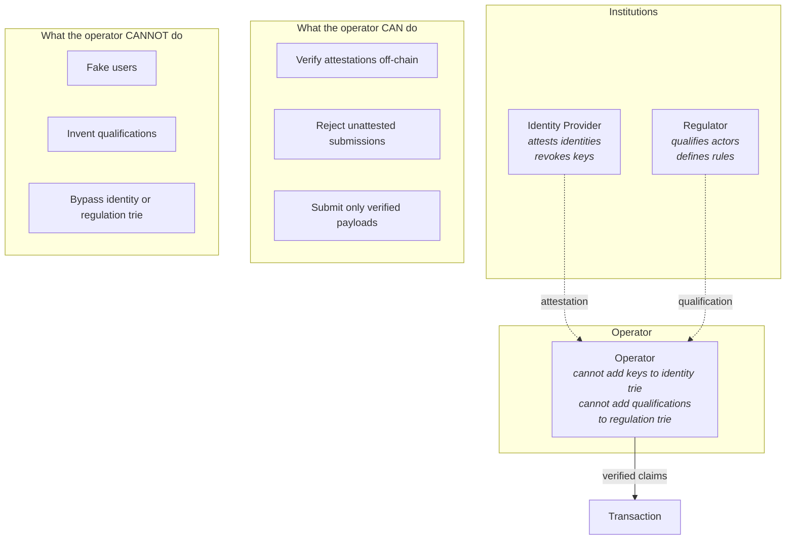

The operator can verify attestations from the institutions and be sure they
are operating with attested, qualified users. But they cannot invent fake
processes involving non-attested users — the smart contract will reject any
transaction where the actor's key is missing from the identity or regulation trie.

## How a transaction works

Every state transition follows this flow:

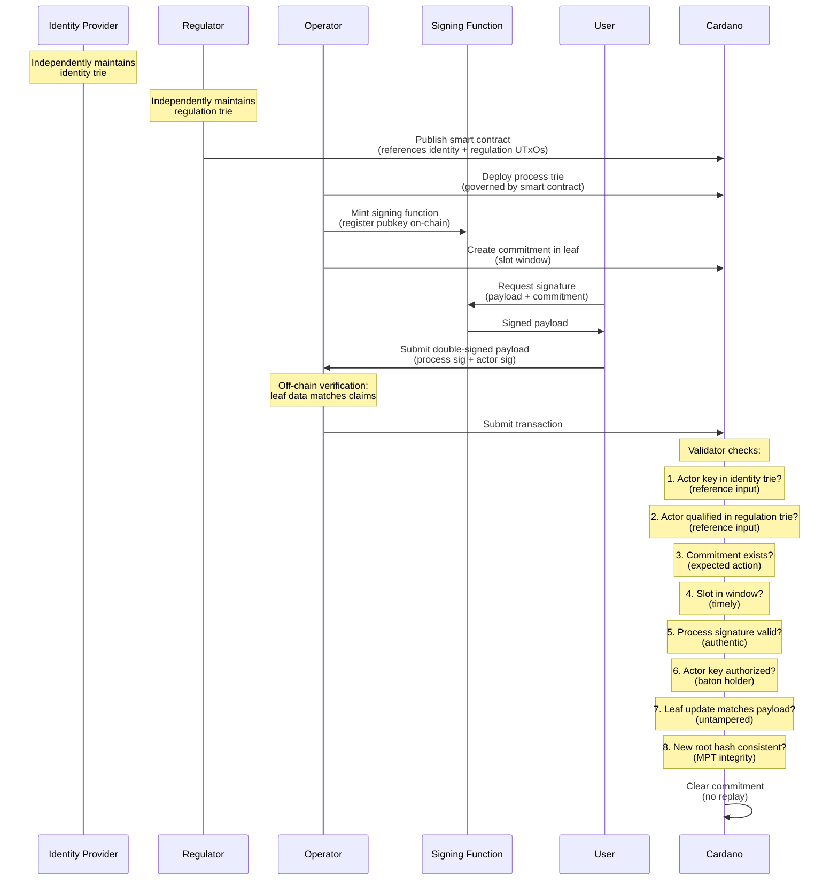

The validator has access to all the information it needs in a single
evaluation: the process trie UTxO (spent input), the identity trie UTxO and
regulation trie UTxO (reference inputs), the signatures, and the slot range.

## What the regulator produces

The regulator does two things: maintains a **regulation trie** and publishes
a **smart contract**.

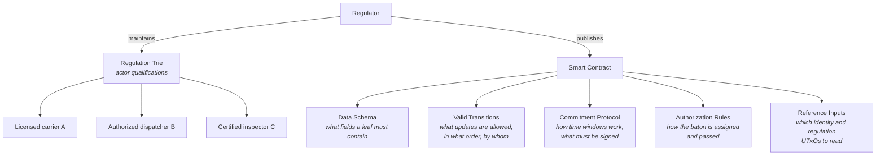

The **regulation trie** contains process-specific actor qualifications —
not generic identity (that's the identity provider's job), but credentials
specific to what this regulation requires. A traceability regulation might
qualify actors as licensed carriers, authorized dispatchers, or certified
inspectors.

The **smart contract** encodes the regulation as a Plutus validator. The
regulator publishes it once. Every operator in the market operates under it.
The regulator audits that operators use the correct smart contract and
follows the transactions over it.

The regulator does not run the identity infrastructure. They decide **which
identity provider to trust** — a government identity agency, eIDAS, a private
service — and reference that provider's UTxO in their smart contract
alongside their own regulation trie UTxO.

The eUTxO model ensures the validator is evaluated at every transaction.
Non-compliant updates are rejected by the chain itself. The regulation is
enforced at the transaction level, not by inspectors after the fact.

## What the identity provider does

The identity provider maintains a Merkle Patricia Trie of verified actors.

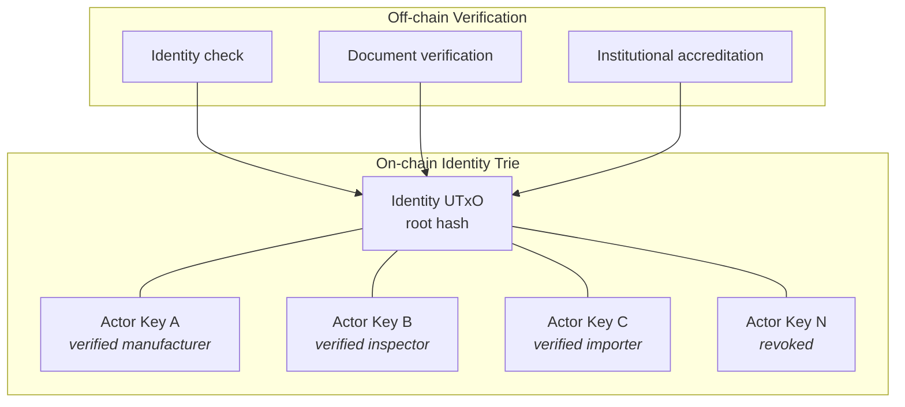

The identity provider:

1. **Verifies real-world entities** — through whatever process they use
   (government ID, corporate registration, professional accreditation)
2. **Adds public keys to their trie** — each verified entity gets a leaf
3. **Revokes keys** — when an entity's status changes, their leaf is
   updated or removed
4. **Maintains the UTxO** — independent of any specific regulation

The same identity trie can serve multiple regulators and multiple regulations.
One identity infrastructure, many smart contracts referencing it. Or
different regulators can trust different providers — each contract points
to its own.

This is what prevents the operator from faking users. The operator can
mint signing functions and simulate processes, but they cannot add keys to
the identity provider's trie. Every actor in a regulated process must have a
key that appears in the trusted identity trie. The validator checks this via
reference input at every transaction.

## What the operator does

The operator participates in the regulated market. They manage a process
trie — one UTxO holding the root hash — containing all items or processes
under their responsibility.

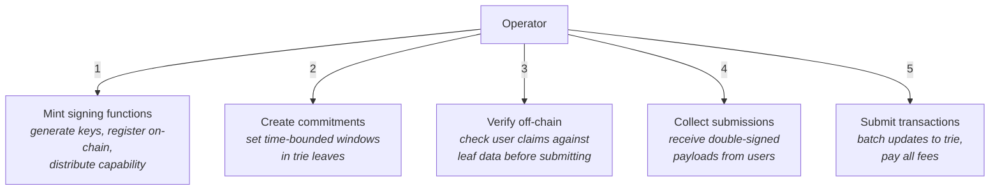

The operator is a **transparent pipe**. They choose *when* to batch, but
not *what* goes in. The signed payload is the input, the leaf update is
the output, and the contract verifies they match.

The operator **verifies off-chain** what the smart contract cannot see:
the actual data behind the hashes. This is the operator's added value —
they leverage institutional attestations (from identity and regulation tries)
to be sure they are operating with attested, qualified users, and they
verify the actual claims before submitting the transaction.

The operator cannot tamper with the data:

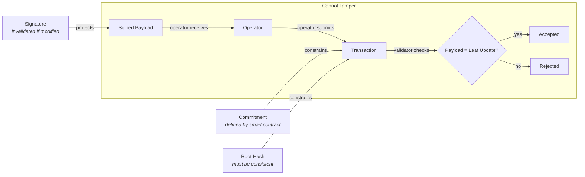

- The commitment is defined by the smart contract
- The payload is signed (tampering invalidates the signature)
- The update is validated by the smart contract
- The new root hash must be consistent with the leaf change

## What the user does

The user interacts with a regulated process without any blockchain knowledge.
They don't have a wallet, don't hold ADA, don't know what Cardano is.

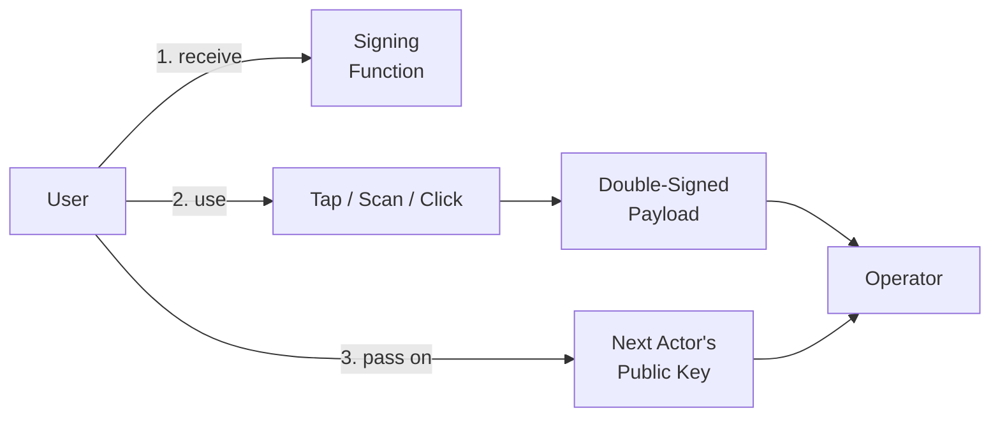

1. **Receive a signing capability** — a physical device, an app, or access
   to a signing service
2. **Perform the regulated action** — tap an NFC chip, scan a QR code,
   press a button in an app
3. **Pass the baton** — the final action designates the next authorized key

From the user's perspective: tap, use, pass on. The cryptography is
invisible.

## The signing function

The atomic unit of the system is not a key, not a device, not a user — it
is a **signing function**. An opaque capability that produces signatures
when invoked, without exposing the private key.

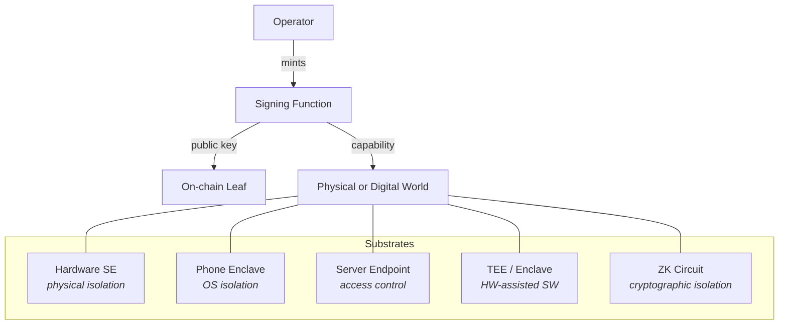

| Substrate | Key protection | When to use |
|-----------|---------------|-------------|
| Hardware secure element (SE050) | Physical isolation — key never leaves chip | Sensor-bound, physical measurements |
| Phone secure enclave | OS-level isolation | Consumer actions |
| Server endpoint | Access control | Abstract processes, enterprise |
| TEE / enclave | Hardware-assisted software isolation | High-assurance backends |
| ZK circuit | Cryptographic isolation | Privacy-preserving proofs |

All substrates present the same interface to the chain: a public key
registered in a leaf, and signatures the validator can verify.

The signing function does not need to be secret. It signs whatever is
asked of it. The security is not in the key's secrecy — it is in the
double signature and the commitment protocol.

### Key slots and reuse

A signing device — physical or software — can hold multiple key slots.
Each slot is an independent signing capability.

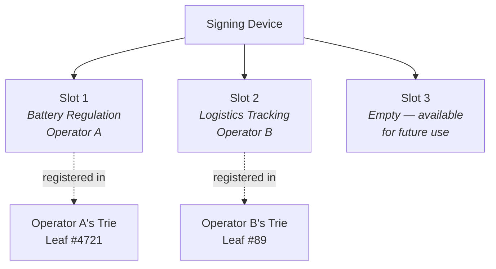

- **One slot, one purpose** — cheap, disposable. Lost? The on-chain key is
  deauthorized.
- **Multiple slots, multiple operators** — the same device participates in
  different compliance schemes simultaneously. Each operator only sees
  their own leaf.
- **Reflash and repurpose** — new key, new on-chain registration, new
  meaning. The device outlives any single use case.

The device has no owner in the blockchain sense. It has a *holder*. The
meaning of each slot is defined entirely by the on-chain leaf it's
registered in. The same hardware can be recollected and reused indefinitely,
as long as it has available slots.

## The double signature

Every state transition requires two signatures:

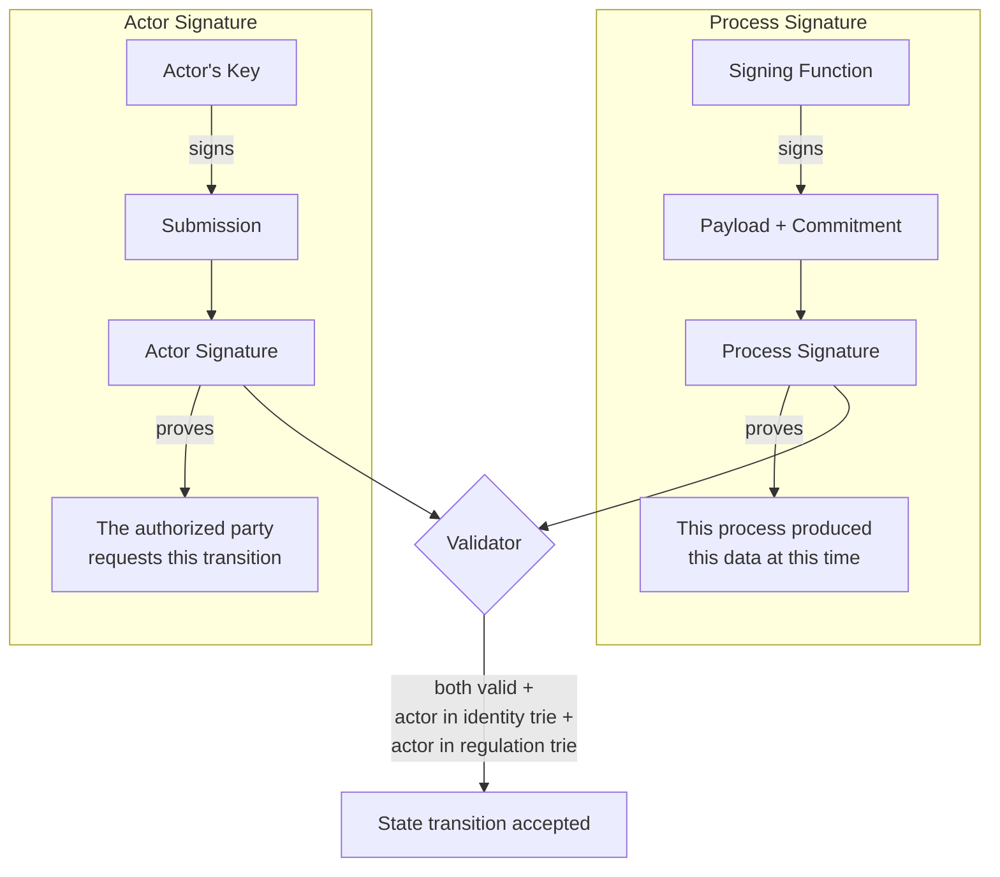

1. **The process signature** — the signing function signs the payload,
   including the commitment. This proves: *this specific process or item
   produced this specific data at this specific time*. It is an identifier,
   not an access control.

2. **The actor signature** — the current baton holder signs the submission.
   This proves: *the authorized party is requesting this state transition*.
   This is the access control.

Neither signature alone is sufficient:

- Process signature without actor signature → anyone could have called
  the signing function, no authorization
- Actor signature without process signature → the actor could claim
  anything about the process, no authentication

Together they prove: an authorized, attested, qualified actor interacted
with a specific process and is submitting a specific, time-bounded state
update.

## The commitment protocol

The commitment prevents replay, ensures timeliness, and binds each action
to a specific moment in the on-chain state.

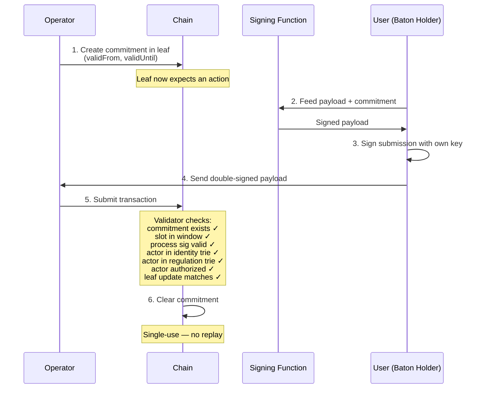

The commitment is the mechanism that turns a generic signing capability
into a one-shot, time-bounded, authorized action. Because the signing
function signs the commitment as part of the payload, and the smart
contract defines what a valid commitment looks like, the operator has no
room to manipulate timing or replay old submissions.

## The baton pattern

Authorization to act on a process is a baton that travels through
the real world — physical or digital.

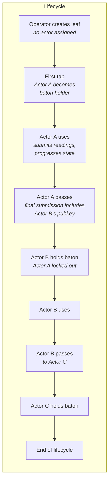

The baton passes atomically with the last action. There is no gap where
nobody holds authorization — the transfer is part of the state transition,
validated by the smart contract.

No user registration. No identity database. No login. Authorization is
determined entirely by the on-chain state. You hold the baton or you
don't.

## Two modes

The same architecture supports two fundamentally different modes:

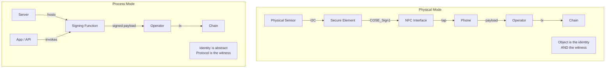

### Physical mode

The object carries its own identity and can attest its own state.

- A battery with a sensor and secure element signs "my state of health
  is 87%"
- The data comes from the thing itself — a physical measurement
- No server needed — the object is both the identifier and the witness
- Trust comes from the hardware: the sensor measured reality, the secure
  element signed it, the chain anchored it

Use when: the regulation requires physical measurements, sensor data,
or tamper-evident attestation from the object itself.

### Process mode

There is no physical object — just a logical process advancing through
stages.

- A permit application moves from applicant → reviewer → approver
- A certification workflow passes through inspector → auditor → issuer
- A supply chain declaration flows from producer → transporter → customs

The signing function lives on a server. The operator mints a key pair,
registers the public key on-chain, and makes the signing function
available. The identity is abstract — it represents a process, not a
thing.

Trust comes from the protocol: the double signature proves the right
actor performed the right action, the commitment proves timeliness, the
smart contract proves correctness.

Use when: the regulation governs a multi-party workflow where what
matters is that the right sequence of actions happened, not what a
physical sensor measured.

### Same architecture

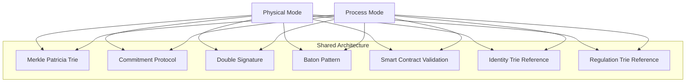

The difference is the trust basis: hardware attestation vs protocol
enforcement. Physical mode is strictly stronger (you get process
guarantees *plus* physical attestation), but process mode covers
regulations that have no physical component.

## Privacy

No single party has the full picture:

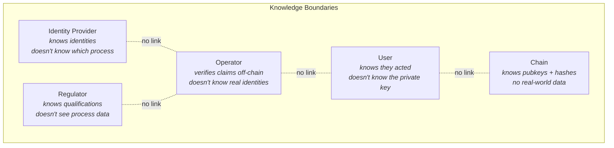

| Party | Knows | Doesn't know |
|-------|-------|-------------|
| **Identity provider** | Real-world identity behind each attested key | Which processes the key participates in |
| **Regulator** | Which actors are qualified for their regulation | Process data, operator activity |
| **Operator** | Claims and leaf data (verified off-chain) | Real-world identity behind the keys |
| **User** | That they interacted with a signing function | The private key |
| **Chain** | Public keys, hashes, and valid signatures | Any actual data or real-world identities |

The identity provider knows identities but not processes. The regulator knows
qualifications but not process data. The operator verifies claims but
doesn't know identities. The chain sees only hashes and signatures. No
single party can reconstruct the full picture.

Privacy is structural, not policy-based. The chain only stores hashes —
the actual data behind the leaves is verified off-chain by the operator.
The on-chain proofs (signatures, trie membership) establish *that* the
right things happened without revealing *what* the actual content is.

## The full picture

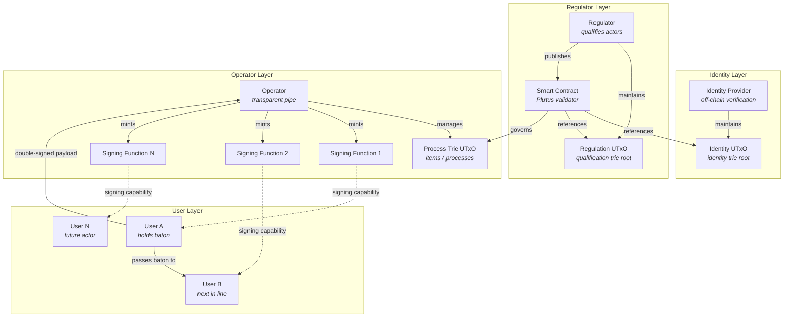

## Summary

The regulator's workflow:

1. **Analyze the regulation** — extract the data schema, valid transitions,
   parties, qualifications, and deadlines
2. **Maintain a regulation trie** — qualify actors with process-specific
   credentials (licensed carrier, authorized dispatcher, etc.)
3. **Choose a identity provider** — decide which identity infrastructure to
   trust, reference its UTxO
4. **Publish the smart contract** — encode the regulation as a Plutus
   validator that references both the identity and regulation tries
5. **Audit** — verify that operators use the correct smart contract and
   follow the transactions over it

The identity provider's workflow:

1. **Verify entities** — through off-chain identity checks
2. **Maintain the trie** — add, update, or revoke actor keys
3. **Serve multiple regulators** — the same trie can be referenced by
   many smart contracts

The operator's workflow:

1. **Deploy a trie** — create a UTxO governed by the regulator's contract
2. **Mint signing functions** — generate keys, register on-chain, distribute
3. **Verify off-chain** — check user claims against leaf data before
   submitting
4. **Collect and submit** — receive double-signed payloads, batch into
   transactions
5. **Pay fees** — compliance is cheaper than non-compliance

The user's workflow:

1. **Receive** — get a device or access to a signing function
2. **Use** — tap, scan, click
3. **Pass on** — designate the next actor in your final submission

No blockchain knowledge required at any level. The regulator qualifies
actors and publishes rules. The identity provider attests identities. The
operator leverages institutional attestations and follows the rules.
The user participates. The chain enforces.

## Why Cardano

This analysis is based on Cardano's capabilities. The design patterns
described here — signing functions, double signatures, commitment
protocols, the baton pattern — are conceptual and other blockchains are
free to find their own way to implement them.

That said, the on-chain requirements are non-trivial:

- **Merkle Patricia Trie verification in the validator** — the smart
  contract must verify that a leaf update produces the correct new root
  hash. This is Merkle proof verification at every transaction.
- **Reference inputs** — the validator must read the identity and regulation
  trie UTxOs without spending them. This is a Cardano-native feature
  (CIP-31) that enables cross-trie verification without coordination.
- **Native signature verification** — Ed25519 and secp256k1 must be
  available as cheap built-in operations, not expensive general-purpose
  computation.
- **Full transaction context** — the validator must see the previous state,
  the new state, all signatures, and the current slot range in a single
  evaluation.
- **Deterministic payload parsing** — CBOR/COSE decoding inside the
  validator to check that signed data matches the state update.
- **Economically viable validator complexity** — all of the above must
  fit within the execution budget of a single transaction at reasonable
  cost.

Cardano's eUTxO model and Plutus built-ins meet these requirements. The
UTxO model naturally maps to the operator-owns-their-trie pattern — one
UTxO per operator, the validator sees the full spend-and-produce context,
reference inputs enable cross-trie identity and regulation checks, and native
built-ins for Ed25519 and secp256k1 make signature verification practical.

Other chains may offer equivalent primitives. The schema does not depend
on Cardano-specific features at the design level — but the implementation
does depend on a chain that can handle non-trivial smart contract logic
at reasonable cost.
