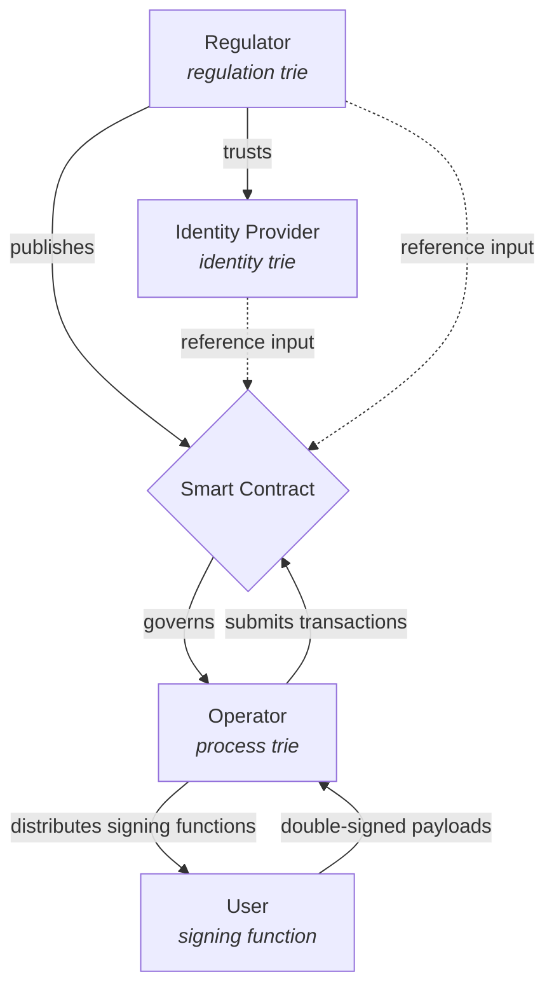
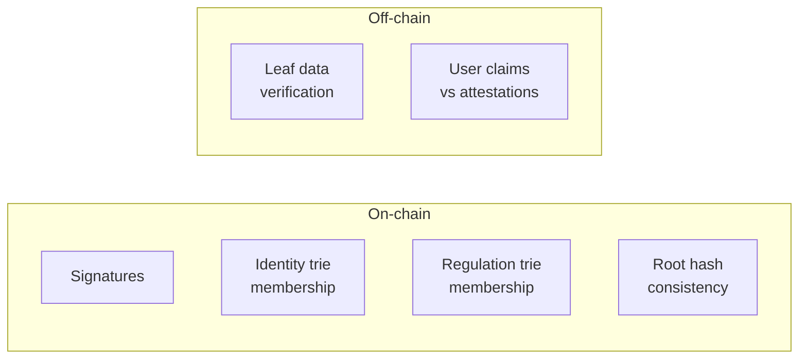
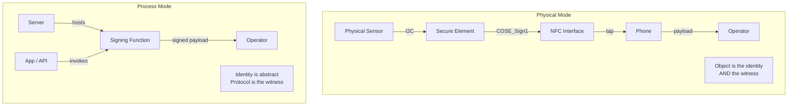

# Cardano for Regulators

How a regulator can use Cardano to enforce a multi-party regulation without
running infrastructure, managing identities, or trusting any single operator.

Start with [**The Thesis**](thesis.md) — why blockchain is the right tool
for regulated multi-party systems, and why the economics work.

## Four parties, zero trust

A regulated process involves four independent parties. Each manages one
concern and trusts no other party beyond what the chain enforces.

| Party | Trie | Contains |
|-------|------|----------|
| **Identity provider** | Identity trie | Attested actor public keys |
| **Regulator** | Regulation trie | Actor qualifications for this regulation |
| **Operator** | Process trie | Items, processes, state |
| **User** | — | Just acts via signing function |

## On-chain and off-chain verification

Privacy requires splitting verification across two layers. The chain
verifies signatures, trie membership, and hash consistency. The operator
verifies the actual data behind the hashes off-chain.

Institutions (identity provider + regulator) are responsible for identity and
qualifications. The operator leverages their attestations but cannot
invent fake users or qualifications.

## Two modes, same architecture

- **Physical mode** — a battery, a sensor, a chip. The object carries its
  own identity and attests its own state.
- **Process mode** — a permit, a certification, a supply chain declaration.
  The signing function lives on a server, the identity is abstract.

## Knowledge graph

Explore the framework interactively — nodes, edges, and guided tours
covering the thesis, architecture, constraints, and both case studies.

[**Open the knowledge graph**](https://lambdasistemi.github.io/graph-browser/?repo=lambdasistemi/cardano-for-regulators){ .md-button .md-button--primary }

## What you'll find here

- [**The Thesis**](thesis.md) — the economic and philosophical case for
  blockchain as regulated compliance infrastructure
- [**The Regulator Schema**](framework/schema.md) — the full architecture:
  four parties, signing functions, double signatures, the commitment
  protocol, the baton pattern, and the two modes
- [**The Five Constraints**](framework/constraints.md) — what makes a
  regulation a good fit: data cadence, sequential access, liveness, fee
  alignment, identity delegation
- [**Analysis Methodology**](framework/methodology.md) — step-by-step process
  for decomposing a regulation into on-chain patterns
- [**Architecture Patterns**](framework/patterns.md) — reusable patterns
  (MPT-per-operator, commitment protocols, relay state machines, reward
  distribution)
- [**Case Studies**](cases/battery-regulation.md) — regulations analyzed
  through this framework
