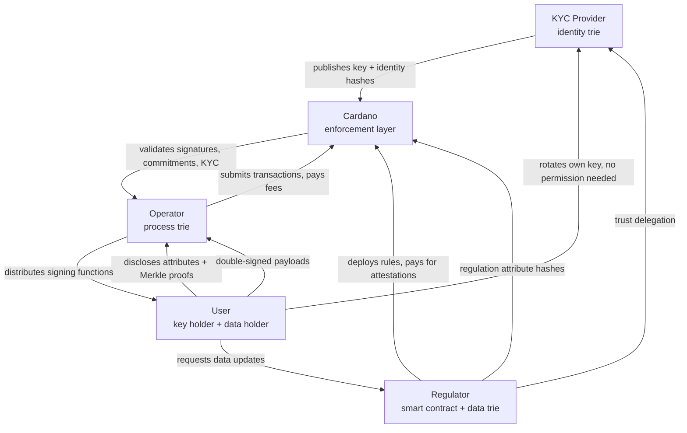
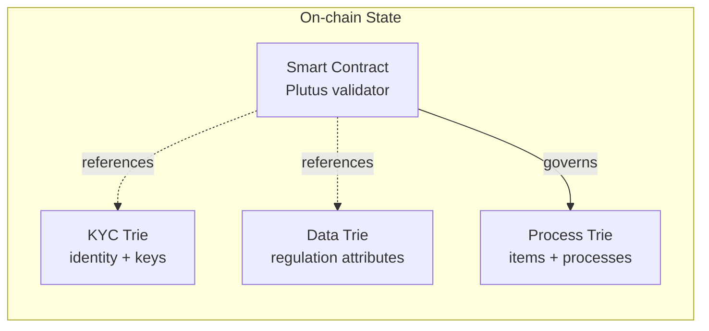

# Cardano for Regulators

A framework for analyzing multi-party regulations and mapping them to
Cardano compliance infrastructure — without any party running
infrastructure, managing identities, or trusting a single operator.

## The premise

When a regulation involves an **institution** setting rules for **multiple
parties** who exchange value, credentials, or obligations — and **citizens**
need to trust the outcome — blockchain can serve as neutral compliance
infrastructure that no single party controls.

Not every regulation fits. This framework provides a systematic method to
decide which ones do, and how to architect the solution.

## The four-party model

The architecture separates concerns across four independent parties.
The edges show what flows between them — data, trust, and value.

Three Merkle Patricia Tries on-chain — each owned by a different party,
each serving a different concern:

| Party | Role | Sovereignty |
|-------|------|-------------|
| **KYC provider** | Attests real-world identities. Maintains a trie of verified actors with their current public keys and identity data hashes. Reusable across regulators. | Controls attestation lifecycle (attest, suspend, reinstate, revoke) |
| **Regulator** | Writes the smart contract (the regulation in executable form) and maintains a data trie of regulation-specific user attributes. | Defines the rules, pays for data attestations |
| **Operator** | Manages the process trie — items and processes governed by the smart contract. Mints signing functions, collects submissions, submits transactions. | Transparent pipe — cannot deviate from the contract |
| **User** | Participates in regulated processes. Holds their own data and discloses it selectively to operators via Merkle proofs. | Controls their own key rotation. Chooses what to disclose. |

## Key design principles

**User sovereignty.** The user controls their own cryptographic key. Key
rotation requires only the previous key's signature — no KYC provider,
no operator, no off-chain process. The rest of the system keeps working
because operators reference the trie leaf, not the key directly.

**Selective disclosure.** Both identity data (name, address) and
regulation-specific data (licenses, certifications) are stored as Merkle
trees of hashes. The user holds the actual data off-chain and reveals
only the attributes needed, with Merkle proofs the operator can verify
against on-chain roots.

**No blockchain knowledge required.** Users tap, scan, or click. They
don't have wallets, don't hold ADA, don't know what Cardano is. The
cryptography is invisible.

**Structural privacy.** The KYC provider knows identities but not
processes. The regulator knows qualifications but not which operators the
user works with. The operator sees only what the user reveals. The chain
sees only hashes and signatures. No single party has the full picture.

## The five constraints

For a regulation to be a good candidate for blockchain-based compliance, five
constraints must be satisfied:

1. **Data cadence** — the regulation's update rhythm is compatible with L1
   settlement (periodic, event-driven, not real-time streaming)
2. **Sequential access** — writes to the shared state are naturally serialized,
   whether by a single operator or a relay of actors taking turns
3. **Liveness** — the regulation itself provides deadlines and penalties that
   incentivize participation, or the protocol has timeout/escalation paths
4. **Fee alignment** — an actor exists who benefits enough from on-chain
   compliance to pay transaction costs (usually the obligated party)
5. **Identity delegation** — actors who will never have wallets can still
   make meaningful state transitions through cryptographic proxies (hardware,
   institutional credentials, delegated keys)

These constraints were extracted from the
[EU Digital Product Passport](cases/battery-regulation.md) work on the Battery
Regulation.

## Structure

- [**The Regulator Schema**](framework/schema.md) — the core architecture:
  four parties (KYC provider, regulator, operator, user), signing functions,
  double signatures, the commitment protocol, the baton pattern, key
  sovereignty, selective data disclosure, and the two modes (physical and
  process)
- [**The Five Constraints**](framework/constraints.md) — what makes a
  regulation a good fit: data cadence, sequential access, liveness, fee
  alignment, identity delegation
- [**Analysis Methodology**](framework/methodology.md) — step-by-step process
  for decomposing a regulation into on-chain patterns
- [**Architecture Patterns**](framework/patterns.md) — reusable patterns
  (MPT-per-operator, commitment protocols, relay state machines, reward
  distribution)
- [**Case Studies**](cases/battery-regulation.md) — regulations analyzed
  through this framework
