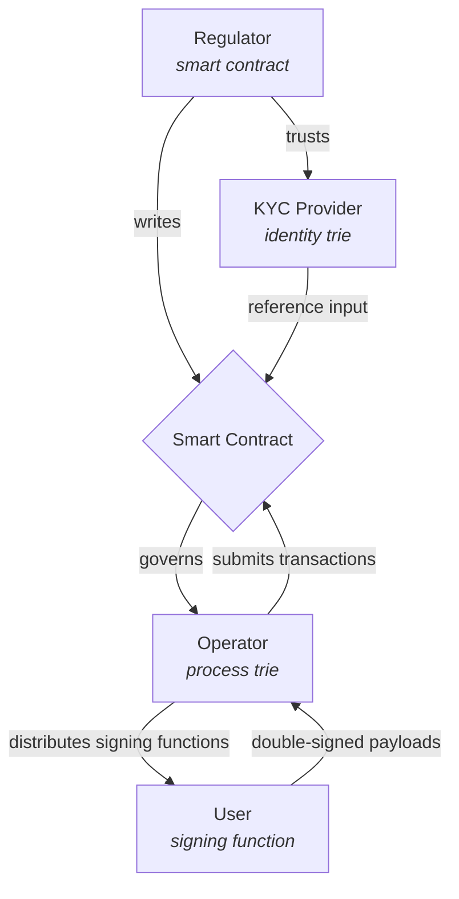
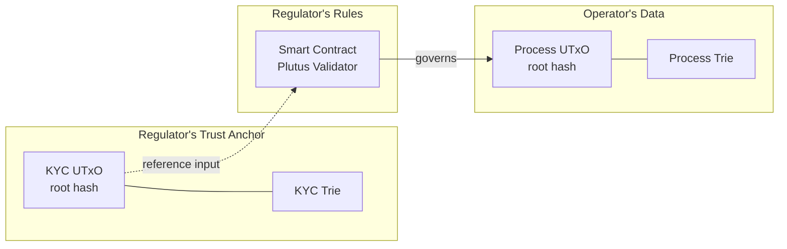
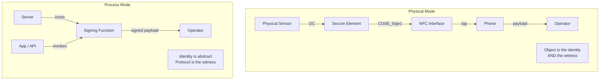

# Cardano for Regulators

How a regulator can use Cardano to enforce a multi-party regulation without
running infrastructure, managing identities, or trusting any single operator.

## Four parties, zero trust

A regulated process involves four independent parties. Each manages one
concern and trusts no other party beyond what the chain enforces.

| Party | Manages | Trusts |
|-------|---------|--------|
| **Regulator** | Smart contract — the rules of the game | The KYC provider's UTxO |
| **KYC provider** | Identity trie — attested actor public keys | Their own verification process |
| **Operator** | Process trie — items and processes | The smart contract — cannot deviate |
| **User** | Nothing — just acts | The signing function they received |

## On-chain architecture

Three Merkle Patricia Tries, three UTxOs, three owners. The regulator's
smart contract governs the operator's trie and reads the KYC provider's
trie as a reference input.

## Two modes, same architecture

The framework supports two fundamentally different modes under the same
on-chain architecture:

- **Physical mode** — a battery, a sensor, a chip. The object carries its
  own identity and attests its own state.
- **Process mode** — a permit, a certification, a supply chain declaration.
  The signing function lives on a server, the identity is abstract.

## What you'll find here

- [**The Regulator Schema**](framework/schema.md) — the full architecture:
  four parties, signing functions, double signatures, the commitment
  protocol, the baton pattern, and the two modes
- [**The Five Constraints**](framework/constraints.md) — what makes a
  regulation a good fit: data cadence, sequential access, liveness, fee
  alignment, identity delegation
- [**Analysis Methodology**](framework/methodology.md) — step-by-step process
  for decomposing a regulation into on-chain patterns
- [**Architecture Patterns**](framework/patterns.md) — reusable patterns
  (MPT-per-operator, commitment protocols, relay state machines, reward
  distribution)
- [**Case Studies**](cases/battery-regulation.md) — regulations analyzed
  through this framework
